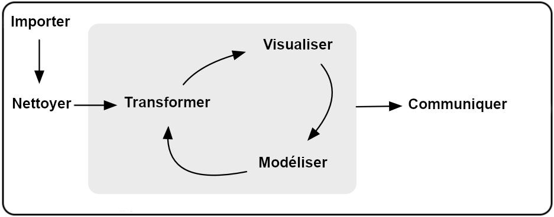
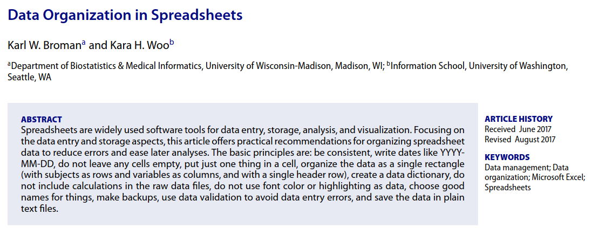
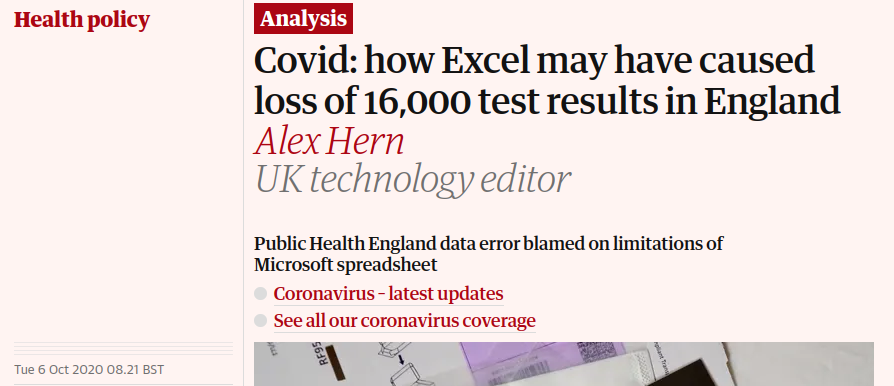
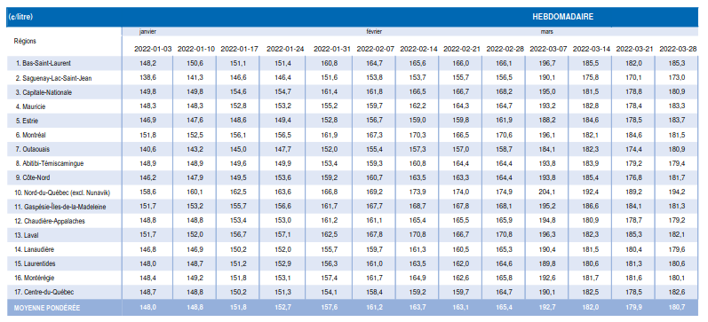
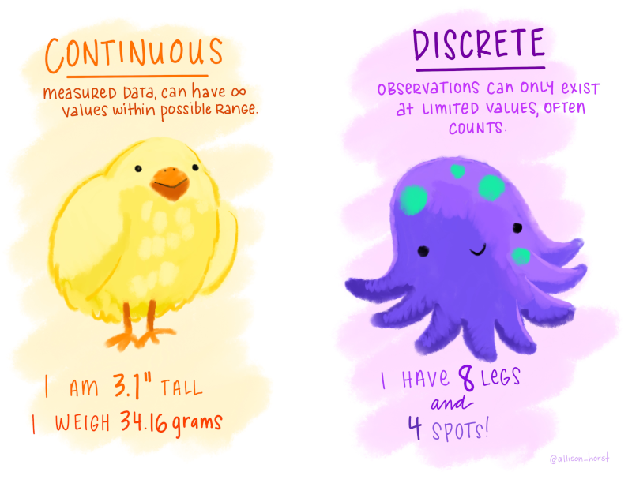
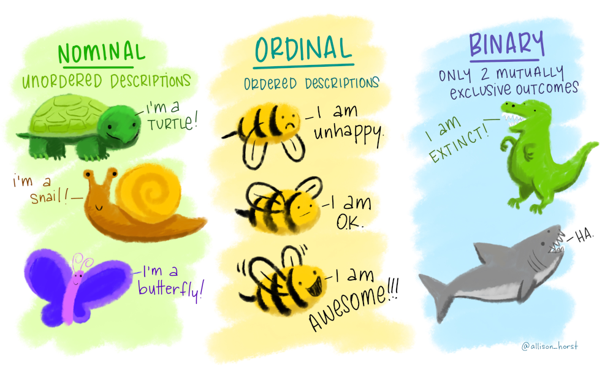
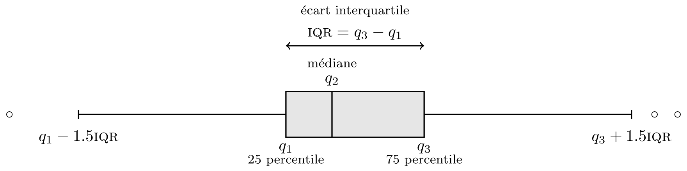
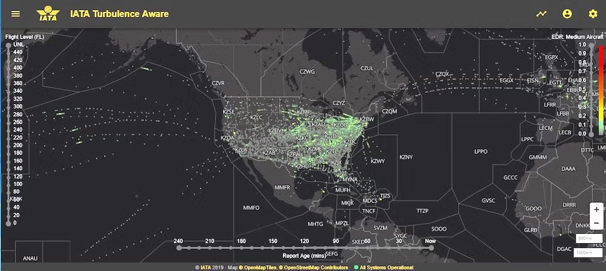
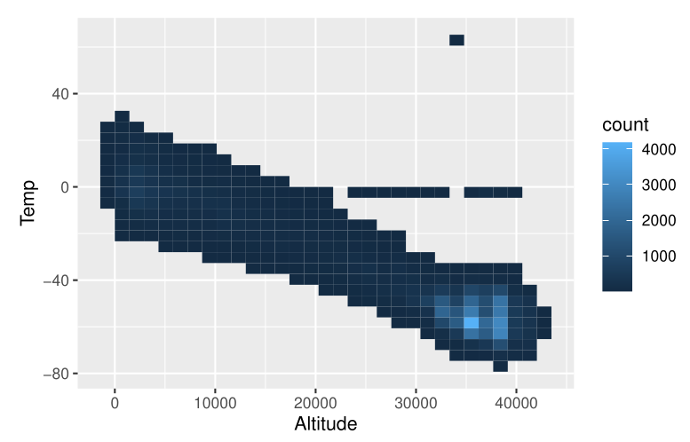

# Organisation du travail

```{r}
#| echo: false
#| eval: true
#| fig-cap: "Adapté de *R for Data Science*, H. Wickham et G. Grolemund"
#| out-width: '90%'

```

# Organisation des données

**Quelques bonnes pratiques**




> Karl W. Broman & Kara H. Woo (2018) Data Organization in Spreadsheets, The American Statistician, 72:1, 2-10, DOI: 10.1080/00031305.2017.1375989

# Nettoyage des données

- Toujours garder une copie des données brutes
- Automatiser le nettoyage


```{r}
cowplot::ggdraw() + 
  cowplot::draw_image("figures/excel-kenya-census-rohan.png", width = 0.5) + 
  cowplot::draw_image("figures/reproducibility.png", width = 0.5, x = 0.5)
```

Ne jamais ouvrir et modifier/sauvegarder les données dans Excel!

# Histoires d'horreur


```{r echo=FALSE, eval = TRUE, fig.cap="Capture d'écran d'un article du quotidien *The Guardian*", out.width='90%'}

```


# Types de données

Certains types de données méritent une attention particulière

- Séries chronologiques ou longitudinales: corrélation
- Données de sondage: pondération
- Données de survie: information incomplète


# Données en format "propre"

- variables en colonnes
- observations en lignes
- une seule mesure par cellule

```{r, out.width='70%', fig.cap="Allison Horst (CC BY 4.0)"}
knitr::include_graphics("figures/tidydata_1.jpg")
```

# Exemple

Quel est le format de ces données de la Régie de l'Énergie?

```{r, out.width='100%'}

```


# Types de variables


:::: {.columns}

::: {.column width="40%"}

```{r}
#| out-width: '100%'

```

:::


::: {.column width="60%"}

```{r}
#| out-width: '100%'
#| label: fig-variables
#| fig-cap: "Allison Horst (CC BY 4.0)"

```

:::

::::


# Validation des données

Vérifier la présence de

- valeurs manquantes (`NA`, points, cellules vides, 999, -1, etc.)
- relations logiques (total, moyenne, etc.) entre variables
- variables catégorielles non déclarées
   - valeur entière (par ex., jours de la semaine)
   - chaînes de caractère

# Visualisation

## Quel est l'avantage des graphiques? 

> *Un simple graphique transmet plus d'information à l'analyste que n'importe quel autre option* 

:::: {.columns}

::: {.column width="80%"}

:::

::: {.column width="20%"}
 John Tukey
:::

::::


## Pourquoi créer des graphiques?

> *Les résumés numériques focalisent l'attention sur les valeurs attendues, les résumés graphiques sur les valeurs inattendues.* 

:::: {.columns}

::: {.column width="80%"}

:::
  
::: {.column width="20%"}
John Tukey
:::

::::

# Choix graphiques

## Qu'est ce qu'un bon graphique?

> *communique des idées complexes avec clarté, précision et efficacité ... le graphique qui offre au lecteur le plus grand nombre d'idées le plus rapidement possible avec le moins d'encre et le plus petit espace possible*  

:::: {.columns}

::: {.column width="70%"}

:::

::: {.column width="30%"}
Edward Tufte, 1983
:::

::::


---

# Grammaire des graphiques


:::: {.columns}

::: {.column width="40%"}
```{r, out.width='80%'}
knitr::include_graphics("img/03/gg-book.jpg")
```
:::

::: {.column width="60%"}

- Éléments (couches):
    - données
    - application (variable $\to$ esthétique)
    - objets géométriques
    - transformations
    - positionnement
- Échelle / guide
- Coordonnées (facettes, système de coordonnés)

:::

::::


# Règles d'or 

Pour une visualisation effective:

1. le choix du graphique dépend du type de variable
2. soignez les apparences
3. portez une attention particulière à la perception visuelle humaine

# Règle 1: choix de graphiques


:::: {.columns}

::: {.column width="50%"}

Avec une variable:


- continue: histogramme, densité
- discrète: diagramme en bâton
- catégorielle: diagramme en bâton (fréquence ou pourcentage)

:::


::: {.column width="50%"}

Avec deux variables

- continues: nuage de points
- catégorielles: diagramme à bande (avec couleurs), carte thermique
- continue $\times$ catégorielle: boîte à moustache, graphique violon


:::

::::

---

```{r}
#| label: figure-renfe_barplot
#| fig-width: 6
#| fig-height: 4
#| fig.align: center
data(renfe, package = "hecmulti")
library(ggplot2)
ggplot(data = renfe, 
       aes(y = forcats::fct_rev(forcats::fct_infreq(classe)))) + 
  geom_bar(aes(x = ..count.. / sum(..count..)), 
           alpha = 0.5) +
  labs(subtitle = "Répartition des billets de train selon la classe", 
       x = "", y = "")  +
  scale_x_continuous(expand = c(0,0), 
                     labels = scales::percent_format(accuracy = 1L)) + 
  theme_minimal() + 
  theme(panel.grid.major.y = element_blank(),
        plot.subtitle = element_text(hjust = 0))
   
```

---

```{r renfe_hist}
#| fig-width: 6
#| fig-height: 3.5
#| fig-align: 'center'
#| dev: png
#| dpi: 200
renfe |> 
  subset(tarif == "Promo") |>
  ggplot(aes(x = prix)) + 
    geom_histogram(aes(y = (..count..)/sum(..count..)), bins = 30) +
    geom_rug(sides = "b") + 
    labs(x = "prix (en euros)", 
         y = "",
         title = "Répartition du prix des billets de train",
         subtitle = "billets au tarif Promo entre Barcelone et Madrid.") +
  scale_y_continuous(labels = scales::percent_format(accuracy = 1L)) + 
   scale_x_continuous(labels = scales::label_dollar(prefix = "", suffix = "€")) + 
   theme_minimal()
```

# Boîte à moustaches {.small}

La boîte donne 

- les quartiles $q_1, q_2, q_3$ (50% des données dans la boîte),
- les moustaches à 1.5 fois l'écart interquartile $q_3-q_1$,
- les valeurs des observations au delà des moustaches.

```{r, out.width='100%'}

```


---


```{r}
#| label: renfe_boxplot
#| cache: true
#| echo: false
#| fig.width: 6
#| fig.height: 4
#| fig.align: 'center'
#| out.width: '100%'
#| dev: png
#| dpi: 200
renfe |> subset(tarif == "Promo") |>
    ggplot(aes(y = prix, x = classe, col = type)) + 
    geom_boxplot() + 
    labs(y = "",
         x = "classe des billets",
         col = "type de train",
         subtitle = "Prix de billets de train au tarif Promo (en euros)") + 
   scale_colour_viridis_d(option = "D") + 
   scale_y_continuous(
     labels = scales::label_dollar(prefix = "", 
                                   suffix = "€")) + 
   theme_minimal() + 
   theme(legend.position = "bottom")
```

---

```{r renfe_nuagepts_code}
#| fig.width: 6
#| fig.height: 4
#| fig.align: 'center'
#| out.width: '70%'
#| dev: png
#| dpi: 200
renfe |> subset(type != "REXPRESS") |>
    ggplot(aes(x = duree, y = prix, col = type)) + 
    geom_point() + 
    labs(y = "", 
         x = "durée de trajet (en minutes)",
         col = "type de train",
         subtitle = "Prix de billets de train en fonction de la durée de trajet") + 
   scale_colour_viridis_d() +
      scale_y_continuous(labels = scales::label_dollar(prefix = "", suffix = "€")) + 
   theme_minimal() +
   theme(legend.position = "bottom")
```

- Qu'est-ce qui cloche dans la représentation graphique précédente?
- Comment pourrait-on remédier aux problèmes soulevés?


# Règle 2: soignez les apparences

Certaines visualisations sont plus effectives/adéquates que d'autres

- votre graphique doit être interprétable uniquement avec la légende
- inclure les noms de variables **et** les unités
- ajouter une description dans le texte et faire une référence croisée

# Éléments graphiques clés

- Titre et annotation
- Libellés et unités sur les axes
- Libellé de l'axe des $y$ en sous-titre
- Inverser les axes si les étiquettes trop longue (variable catégorielles)


# Règle 3: perception visuelle humaine

+ attention au ratio longueur/largeur
+ le texte doit être lisible (taille de la police)
+ espace entre bandes
+ étendu des axes (inclure ou pas zéro)
+ choix de couleurs 
   - noir/blanc avec contraste
   - palettes pour daltoniens
+ comparaison d'aires/superficies (difficile)
+ graphiques 3D / avec rotation superflue à proscrire

# Problèmes de perceptions


```{r}
cowplot::ggdraw() + 
  cowplot::draw_image("figures/Trump-tweet-62917931.png", width = 0.5) + 
  cowplot::draw_image("figures/NOAA_tempete_a.jpg", width = 0.5, x = 0.5)
```


# Mauvaise palette de couleur

- Gauche: Carte originale de la NOAA en niveaux de gris: on voit clairement le problème de saturation

- Droite: solution potentielle avec palette de couleurs différente. 

```{r}
cowplot::ggdraw() + 
  cowplot::draw_image("figures/NOAA_tempete_c.png", width = 0.5) + 
  cowplot::draw_image("figures/NOAA_tempete_b.png", width = 0.5, x = 0.5)
```

(Source [Achim Zeileis](https://www.zeileis.org/news/dorian_rainbow/))


# Étapes de l'analyse exploratoire

1. Formuler des questions
2. Chercher des réponses à ces questions à l'aide de
    - statistiques descriptives
    - tableaux de contingence
    - graphiques
3. Infirmer ou confirmer nos intuitions
4. Raffiner les questions suite aux observations
5. Répéter le processus

Écrire un résumé des trouvailles et des aspects **importants** uniquement.


# Références complémentaires

Pour aller plus loin: 

- [Chapitre 1 de *Data Visualization: A practical introduction* par Kieran Healy](https://socviz.co/lookatdata.html#lookatdata)
- [*Fundamentals of Data Visualization* par Claus O. Wilke](https://serialmentor.com/dataviz/)
- [Chapitre 1 *Data Visalization* de _**R** for Data Science_ (2e edition) par Hadley Wickham, Mine Çetinkaya-Rundel et Garrett Grolemund](https://r4ds.hadley.nz/)


# Étude de cas: IATA

L'[Association du transport aérien international (IATA)](https://www.iata.org/en/about/) est une regroupement de compagnies aériennes commerciales de passagers dont le siège social est situé à Montréal.

Parmi leurs programmes, un vise à prédire la turbulence atmosphérique claire, une cause importante de coûts en raison de 

- blessures lors de vol
- consommation plus importante de carburant (déviation de trajectoire)
- usure accrue des avions

# Mesurer la turbulence

Depuis une dizaine d'années, les avions sont dotés de senseurs qui permettent de mesurer l'intensité de la turbulence atmosphérique mesurée via le taux de dissipation des tourbillons, ou EDR (unités de mesure en $\mathrm{m}^{2/3}/\mathrm{s}$). 

Les mesures sont basées sur un algorithme développé par le centre national de recherche atmosphérique (NCAR) décrit dans [ce rapport technique](https://opensky.ucar.edu/system/files/2024-08/technotes_580.pdf).

# Plateforme *IATA Turbulence Aware*

Depuis 2018, l'IATA a développé une [plateforme](https://www.iata.org/en/services/data/safety/turbulence-platform/) pour traquer en temps réel les zones de turbulence d'air propre, une des principales causes de blessures dans les avions.

```{r}
#| label: fig-iata
#| fig-align: 'center'
#| fig-cap: "Capture d'écran de l'interface du gadget Turbulence Aware (©IATA)"


```

# Données 

Les avions mesurent toutes les minutes la moyenne et le maximum d'EDR, ainsi que

- l'heure,
- l'identifiant du vol,
- la température, 
- la direction et la force des vents,
- la localisation 3D (longitude, latitude, altitude)

Transmettre et stocker toutes ces données est coûteux, et la plupart des mesures d'EDR sont faibles ou nulles.

# Échantillonnage préférentiel

Les avions sauvegardent durant le vol les données à des intervalles réguliers (battement) de 15 ou 20 minutes, et pendant les périodes de turbulence

- type 1: si le maximum dépasse $0.18\mathrm{m}^{2/3}/\mathrm{s}$ à temps $t$, les valeurs chaque minute entre $t-5$ minutes et $t+6$ minutes (12 mesures).
- type 2: si le maximum dépasse $0.12\mathrm{m}^{2/3}/\mathrm{s}$ pour trois des six dernières minutes, les valeurs chaque minute entre $t-5$ minutes et $t+6$ minutes (12 mesures).
- type 3: si la moyenne dépasse $0.06\mathrm{m}^{2/3}/\mathrm{s}$ pour quatre minutes des six dernières, on enregistre $t-5, \ldots, t$ (6 mesures)

# Point de discussion

- Comment l'échantillonnage (complexe) affecte les rapports?
- Les aéroports (départ et arrivée) ne sont pas répartis uniformément sur le globe: comment ça peut affecter les résultats?

# Données manquantes et incohérences:

 Certaines mesures ne sont pas à des intervalles réguliers: exemple d'un avion à

1:32, 1:34, 1:35, 1:36, 1:37, 1:45, 2:00, 2:08, 2:09, 2:11, 2:12, 2:13, 2:15, 2:45...

Pouvez-vous deviner la fréquence des battements?

# Données manquantes et valeurs aberrantes

:::: {.columns}

::: {.column width="40%"}

Certaines valeurs de covariables (température) sont implausibles.


Des valeurs manquantes de température sont exactement zéro (à de plus hautes altitudes).

:::


::: {.column width="60%"}
```{r}

```

:::

::::


# Résumé des sujets de la séance

- Format des base de données
- Types de variables (numériques, catégorielles) et nature des données
- Première étape: nettoyage, validation des données et analyse exploratoire
- Utilisation judicieuse de graphiques dans les rapports
