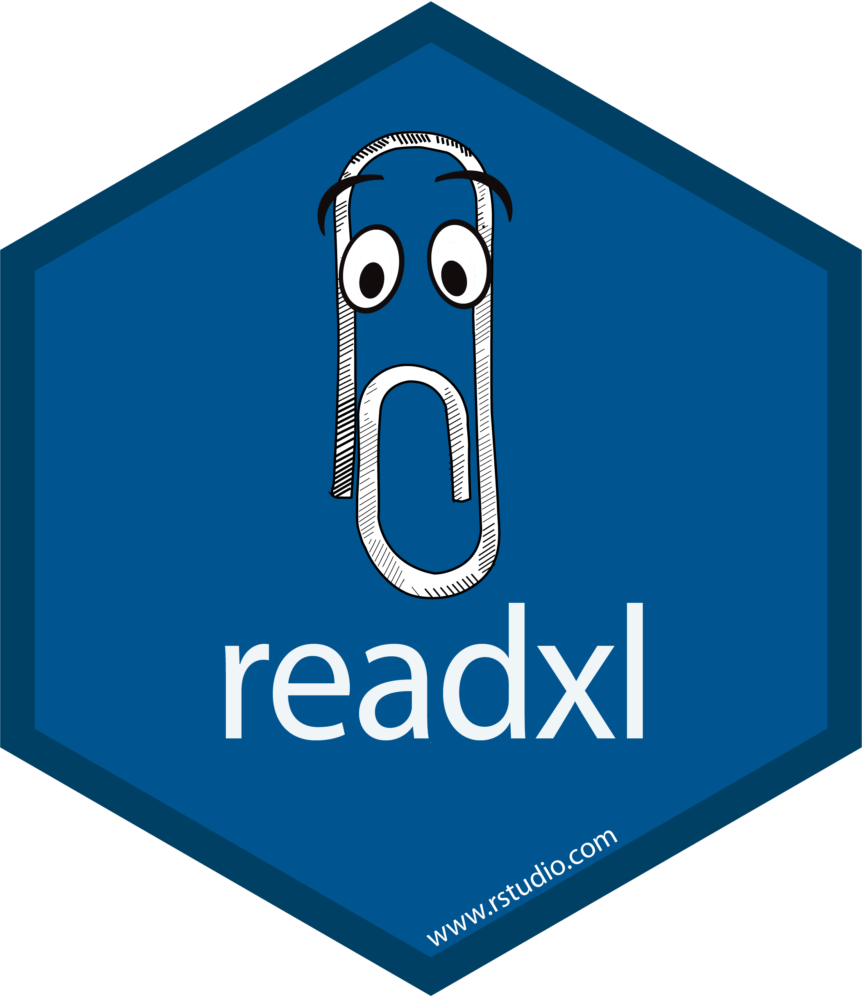

```{r setup, include=FALSE}
knitr::opts_chunk$set(warning = FALSE, message = FALSE, 
                      fig.retina = 3, fig.align = "center")
```

```{r packages-data, include=FALSE}
library(tidyverse)
library(gapminder)
library(countdown)
library(flair)
library(knitr)
library(kableExtra)
# registerS3method(
#   "knit_print", "with_flair", knit_print.with_flair,
#   envir = asNamespace("knitr")
# )
```

```{r xaringanExtra, echo=FALSE}
xaringanExtra::use_xaringan_extra(c("tile_view"))
xaringanExtra::use_share_again()
```

class: center middle main-title section-title-1

# Débuter avec<br>**R** et RStudio

.class-info[
<figure>
  
</figure>
]


---

class: middle

.pull-left.center[
<figure>
  
</figure>

.box-inv-1[langage de programmation]
]

.pull-right.center[
<figure>
  
</figure>

.box-inv-1[environnement de développement intégré]
]

---

class: middle section-title-inv-1

.box-inv-1.large[Un panorama de RStudio]

---


<figure>
  
</figure>

---


class: title title-1
# Console 

.pull-left-wide[
<figure>
  
</figure>
]

.pull-right-narrow[
.box-inv-1[R est en attente de vos instructions]

.box-inv-1[Tapez votre code, et appuyez sur Retour pour le compiler]
]

---


class: title title-1 section-title-inv-1

# À votre tour

.pull-left-wide[
<figure>
  
</figure>
]

.pull-right-narrow[
.box-1[Tapez `2 + 2` dans la console]

.box-1[Appuyez sur Retour]
]

---


```{r}
2 + 2
```

.box-1[Ce calcul est éphémère.<br>Pour recompiler, il faudra retaper les instructions.]

.box-1[On va plutôt enregistrer le code dans un document **R**]

.box-1[On peut aussi assigner le résultat à une variable<br> pour l'utiliser subséquemment]

---
class: title title-1

# Arborescence et fichiers

.box-inv-1.medium.sp-after[**R** pointe vers un répertoire local]

.box-inv-1.medium.sp-after[
Utiliser `getwd()` pour trouver l'emplacement
]

.box-inv-1.medium[Travailler avec chemin relatif]

---


class: title title-1
# Projets dans RStudio

```{r, out.width = '60%',echo=FALSE}

```


---


class: title title-1

# Panneau avec fichiers

.pull-left-wide[
<figure>
  
</figure>
]

.pull-right-narrow[
.box-inv-1[Tous les fichiers dans votre répertoire de travail]
]

---
class: title title-1 section-title-inv-1

# À votre tour

.pull-left-wide[
<figure>
  
</figure>
]

.pull-right-narrow[
.box-1[Trouvez `a-intro.qmd`]

.box-1[Cliquez sur le nom pour ouvrir le fichier]
]

---


class: title title-1
# Panneau source

.pull-left-wide.center[
<figure>
  
</figure>
]

.pull-right-narrow[
.box-inv-1[Les documents<br>s'ouvrent ici]
]


---

class: middle section-title-inv-1

.box-inv-1.large[Paquets]

---

<figure>
  
</figure>

---

<figure>
  
</figure>

---


class: title title-1
# Utiliser des paquets

.pull-left[
```{r eval=FALSE}
install.packages("nom")
```

.box-inv-1[Télécharge les fonctionnalités<br>sur votre ordinateur.]

.box-inv-1[Une fois par ordinateur.]

.box-inv-1[Fichiers téléchargés via le [CRAN](https://cran.r-project.org/web/packages/available_packages_by_name.html).]
]

--

.pull-right[
```{r eval=FALSE}
library(nom)
```

.box-inv-1[Charge le paquet]

.box-inv-1[Effectuer une fois par session]
]
---

class: title title-1  section-title-inv-1

# À votre tour


.box-1[Installez le paquet `remotes`]

.box-1[Utilisez les commandes suivantes pour installer `hecmulti`:]

```{r, eval=FALSE}
remotes::install_github("lbelzile/hecmulti")
```

```{r echo=FALSE}
countdown(minutes = 2, play_sound = TRUE, font_size = "1.5em")
```

---


class: title title-1

# `tidyverse`

.pull-left[
.box-inv-1.small[« Le `tidyverse` est une collection de paquets **R** conçus par des programmeurs opiniâtre pour la science des données. Tous les paquets partagent la même philosophie de conception, et ont une grammaire et une structure commune. »
]
]

.pull-right[
<figure>
  
</figure>
]

---

class: title title-1

# `tidyverse`

<figure>
  
</figure>

???

From "Master the Tidyverse" by RStudio

---


class: title title-1
# Aides-mémoires

.box-inv-1[Allez à Help > Cheatsheets pour<br>trouver des guides de référence sur certains différents paquets]

.center[
<figure>
  
</figure>
]


---


class: title title-1

# Paquets et fonctionalités


.box-inv-1[Charger un paquet ajoute à l'environnement<br> toutes ses fonctions et bases de données.]

.box-inv-1[Peut masquer des fonctions homonymes!]

```
> library(tidyverse)
── Attaching packages ──────────────── tidyverse 1.3.2 ──
✔ ggplot2 3.3.6     ✔ purrr   0.3.4
✔ tibble  3.1.7     ✔ stringr 1.4.0
✔ tidyr   1.2.0     ✔ forcats 0.5.1
✔ readr   2.1.2     
── Conflicts ─────────────────── tidyverse_conflicts() ──
✖ dplyr::filter() masks stats::filter()
✖ dplyr::lag()    masks stats::lag()
```

---

class: title title-1

# Fonctionalités


.box-inv-1[Charger une base de données]

```{r eval=FALSE}
data(bd, package = "nomdupaquet")
```

.box-inv-1[Utiliser directement une fonction sans charger un paquet]

```{r eval=FALSE}
paquet::fonction(...)
```

---
class: title title-1 section-title-inv-1

# À votre tour


.box-1[Chargez les données `renfe` du paquet `hecmulti`]

```{r echo=FALSE}
countdown(minutes = 1, play_sound = TRUE, font_size = "1.5em")
```

--

```{r,eval=FALSE}
data(renfe, package = 'hecmulti')
renfe
```

---

class: title title-1

# Quarto

.pull-left.center[
<figure>
  
</figure>
]

.pull-right[
.box-inv-1[Format de document<br>qui combine texte et code]

.box-inv-1[Un livret<br>pour votre analyse]
]

---

class: title title-1

# Quarto

.pull-left[
<figure>
  
</figure>
]

.pull-right[
.box-inv-1.medium[Texte]
]

---


class: title title-1
# Quarto

.pull-left[
<figure>
  
</figure>
]

.pull-right[
.box-inv-1.medium[Texte]

.box-inv-1.medium[Code]
]

---


class: title title-1
# Quarto

.pull-left[
<figure>
  
</figure>
]

.pull-right[
.box-inv-1.medium[Texte]

.box-inv-1.medium[Code]

.box-inv-1.medium[Sortie]
]

---

class: title title-1 section-title-inv-1

# À votre tour

.pull-left[
<figure>
  
</figure>
]

.pull-right[
.box-1[Lisez les instructions]

.box-1[Compilez le bloc de code<br>avec le bouton `démarrer`]

.box-1.sp-after-half[(icône avec triangle vert)]
]

---

class: title title-1 section-title-inv-1

# À votre tour

.box-1[Ajoutez un nouveau bloc]

.box-1[Inscrivez `2 + 2` et compilez]

---


class: title title-1

# Compilation

.box-inv-1[Compiler un document Quarto]

.center[
<figure>
  
</figure>
]

---

class: title title-1 section-title-inv-1

# À votre tour

.box-1[Quelle est la différence entre:]

```{r eval=FALSE}
filter(mtcars, cyl == 4)
```

```{r eval=FALSE}
four_cyls <- filter(mtcars, cyl == 4)
```

.box-1[Trouvez ces instructions dans votre carnet et compilez ce dernier. <br>Quelle est la différence en sortie?]

---


class: title title-1
# Assignation

.box-inv-1[`<-` assigne la sortie à droite à la variable de gauche]

```{r eval=FALSE}
four_cyls <- filter(mtcars, cyl == 4)
```

---
class: title title-1

# Panneau environnement

.pull-left[
<figure>
  
</figure>
]

.pull-right[
.box-1[Liste de toutes les<br>variables existantes]
]

---

class: title title-1 section-title-inv-1

# À votre tour

.box-1[Trouvez `four_cyls` dans le panneau environnement.<br>Cliquez sur le nom `four_cyls`]

.box-1[Qu'est-ce qui arrive?]

---

class: title title-1

# Visualisation

.pull-left[
<figure>
  
</figure>
]

.pull-right[
.box-1[Cliquer sur un objet dans le panneau environnement l'ouvre dans un onglet de visualisation interactive.]
]


---

class: middle section-title-inv-1

.box-inv-1.large[Objets, classes et types]

---


class: title title-1
# Vecteurs

.box-inv-1[Objet de base dans **R**]

.box-inv-1[Un vecteur est une liste ordonnée de valeurs de même type<br>(texte, nombres, etc.)]

.box-inv-1[Concaténez avec `c()`:]

```{r eval=FALSE}
c(1, 4, 2, 5, 7)
```

---

class: title title-1
# Listes

.box-inv-1[Une liste est une collection d'objets]

```{r}
maliste <- list(elementun = 2:4, FALSE)
maliste
```

.box-inv-1[Format de sortie fréquent pour les fonctions!]

---
class: title title-1

# Éléments d'une liste

.pull-left[
.box-inv-1[Accéder à un élément<br>par nom avec `$`]
```{r eval=FALSE}
maliste$elementun
```
]

.pull-right[
.box-inv-1[Accéder à un élément<br>par position avec `[[ ]]`]
```{r eval=FALSE}
maliste[[1]]
```
]

---
class: title title-1
# Base de données (`data.frame`)

.box-inv-1.sp-after[Une liste avec dimensions]

.box-inv-1.sp-after[Chaque colonne est un vecteur]

.box-inv-1.sp-after[Variables de types potentiellement différents]


.box-inv-1.sp-after[Mais de même longueur]

.box-1[tibble (`tbl`): version `tidyverse`, plus sophistiquée]

---
class: title title-1
# Types de données de base

<table>
  <tr>
    <td><b>Entier (<i>integer</i>)</b></td>
    <td>Nombre entier</td>
    <td><code class="remark-inline-code">c(1L, 2L, 3L, 4L); 1:4</code></td>
  </tr>
  <tr>
    <td><b>Double</b></td>
    <td>Nombres</td>
    <td><code class="remark-inline-code">c(1, 2.4, 3.14, 4)</code></td>
  </tr>
  <tr>
    <td><b>Caractère (<i>character</i>)</b></td>
    <td>Texte</td>
    <td><code class="remark-inline-code">c("1", "bleu", "plaisir", "monstre")</code></td>
  </tr>
  <tr>
    <td><b>Logique (<i>logical</i>) </b></td>
    <td>Vrai ou faux</td>
    <td><code class="remark-inline-code">c(TRUE, FALSE, TRUE, FALSE)</code></td>
  </tr>
 
</table>

.box-inv-1.sp-after-half[Utiliser la fonction `typeof()`<br> pour déterminer le type d'un vecteur.]

---
class: title title-1
# Facteurs (`factor`, `<fct>`)

.box-inv-1.sp-after-half[Vecteurs de variables catégorielles]
.box-inv-1.sp-after-half[
Encodées comme entiers avec étiquettes<br> (étiquettes visible via `levels`)
]
.box-inv-1.sp-after-half[Traitement spécial dans les modèles]

```{r, echo = TRUE, eval = TRUE}
facteur <- factor(x = c(1,2,1,3),
                  labels = c("petit", "moyen", "grand"))
facteur #méthode print
levels(facteur)
```

---
class: title title-1

# Valeurs manquantes

.box-inv-1.sp-after-half[
`NA`, `NaN`, `NA\_integer_`, etc.
]
.box-inv-1.sp-after-half[`is.na()` pour détecter]
.box-inv-1.sp-after-half[`summary()` sur `data.frame`<br> pour décompte par variable]
???

Par exemple, la fonction `summary` retourne le décompte des modalités du facteur plutôt que des statistiques descriptives.

Encodée comme un entier, mais avec `labels`
---


class: title title-1

# Fonctions

.center[
```{r echo=FALSE, tidy=FALSE,eval=FALSE}
flair::decorate('
four_cyls <- filter(mtcars, cyl == 4)
', eval = FALSE) |> 
  flair::flair("filter", background = "#FFDFD1", before = "<b>", after = "</b>")
```
]

.box-inv-1.large[Fonctions égal actions]

--

.box-inv-1[Arguments en intrant, résultats en sortie]

--

.box-inv-1[Spécifier les arguments avec `nomarg = `,  sinon en ordre]


---


class: title title-1
# Aide

.box-inv-1[Pour voir la page d'aide sur une fonction **R**,<br>tapez dans la console:]

.center[
```{r eval=FALSE}
?nom_fonction
# Fonction pas dans l'environnement ou chaîne de caractères
??"normal distribution"
```
]

.box-1[(ou utilisez un moteur de recherche!)]

---

class: title title-1

# Panneau d'aide

.pull-left[
<figure>
  
</figure>
]

.pull-right[
.box-1[Ces fichiers contiennent notamment des détails sur les arguments des fonctions]

.box-1[Il y a souvent des<br>exemples à la fin]
]

---

class: title title-1  section-title-inv-1

# À votre tour

.box-1[Lisez l'aide pour la fonction `seq`]

.box-1[Ajouter un bloc qui utilise `seq()` pour créer un<br>vecteur de nombres de 5 à 30, espacés par sauts de 5<br>.small[(5, 10, 15, 20, …)]]

```{r echo=FALSE}
countdown(minutes = 2, play_sound = TRUE, font_size = "1.5em")
```

---

```{r}
seq(from = 5, to = 30, by = 5)
```


---

class: title title-1

# Problèmes fréquents de syntaxe #1

.box-inv-1[Parenthèses ou accolades de fermeture manquante]

```{r eval=FALSE}
mean(mtcars
```

```{r eval=FALSE}
"Oops problème
```

---

class: title title-1

# Problèmes fréquents de syntaxe #2

.box-inv-1[Ajouter des accolades quand ce n'est pas adéquat (et vice versa)]

```{r error=TRUE, warning=TRUE, message=TRUE}
mean("mtcars")
```

---

class: title title-1

# Problèmes fréquents de syntaxe #3

.box-inv-1[Mauvais nom de fonction (**R** est sensible à la casse)]

```{r error=TRUE, warning=TRUE, message=TRUE}
MEAN(mtcars)
```

---

class: title title-1 section-title-inv-1

# À votre tour

.box-1[Il y a trois blocs sous "Syntaxe fautive"]

.box-1[Compilez chacune, lisez le message d'erreur et essayez de corriger le code]

---


class: title title-1

# Classes et méthodes

.box-inv-1[La classe d'un objet permet de définir<br> des  fonctions génériques (`methods`)]

```{r,eval=FALSE}
methods(class = "lm")
```

.box-inv-1[Autrement dit, le résultat dépend de la classe.]

.box-1[Méthodes fréquentes]
.pull-left-3[
.box-inv-1[impression<br>(`print`)]
]
.pull-middle-3[
.box-inv-1[récapitulatif<br>(`summary`)]

]
.pull-right-3[
.box-inv-1[graphique<br>(`plot`)]
]


---

class: middle section-title-inv-1

.box-inv-1.large[Importer des données]

---

class: title title-1

# Paquets pour l'importation de données

<table>
  <tr>
    <td></td>
    <td>Données texte brutes</td>
    <td><code class="remark-inline-code">my_data <- read_csv("file.csv")</code></td>
  </tr>
  <tr>
    <td></td>
    <td>Chiffriers Excel</td>
    <td><code class="remark-inline-code">my_data <- read_excel("file.xlsx")</code></td>
  </tr>
  <tr>
    <td></td>
    <td>Données Stata, SPSS, et SAS</td>
    <td><code class="remark-inline-code">my_data <- read_stata("file.dta")</code></td>
  </tr>
</table>

