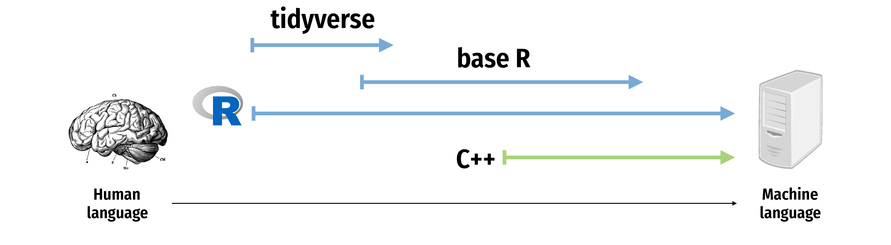

```{r setup, include=FALSE}
knitr::opts_chunk$set(warning = FALSE, message = FALSE, 
                      fig.retina = 3, fig.align = "center")
```

```{r packages-data, include=FALSE}
library(tidyverse)
library(gapminder)
library(countdown)
library(flair)
library(knitr)
```

```{r xaringanExtra, echo=FALSE}
xaringanExtra::use_xaringan_extra(c("tile_view"))
xaringanExtra::use_share_again()
```

class: center middle main-title section-title-1

# Manipuler des<br>bases de données<br>avec `dplyr`

.class-info[
<figure>
  
</figure>
]


---

layout: false
class: title title-1 section-title-inv-1


.small[
```{r show-gapminder}
gapminder
```
]

---

class: title title-1

# tidyverse

<figure>
  
</figure>

???

From "Master the Tidyverse" by RStudio

---

class: title title-1

# tidyverse

.center[
<figure>
  
</figure>
]

---

class: title title-1

# `dplyr`: verbes pour manipuler des données

<table>
  <tr>
    <td>Extraire des lignes avec <code>filter()</code></td>
    <td></td>
  </tr>
  <tr>
    <td>Extraire des colonnes avec <code>select()</code></td>
    <td></td>
  </tr>
  <tr>
    <td>Arranger/trier les lignes avec <code>arrange()</code></td>
    <td></td>
  </tr>
  <tr>
    <td>Créer/modifier des colonnes avec <code>mutate()</code></td>
    <td></td>
  </tr>
  <tr>
    <td>Résumer des sous-ensembles avec<br><code>group_by() |> summarize()</code></td>
    <td></td>
  </tr>
</table>

---

class: center middle section-title section-title-1

# `filter()`

---

layout: false
class: title title-1

# `filter()`

.box-inv-1[Extraire des lignes selon une condition logique]

.pull-left[
```{r show-filter-template, echo=FALSE, tidy=FALSE}
decorate('
filter(.data = DATA, ...)
', eval = FALSE) |> 
  flair("DATA", background = "#FFDFD1", before = "<b>", after = "</b>") |> 
  flair("...", background = "#FFD0CF", before = "<b>", after = "</b>") |>
  flair:::knit_print.decorated()
```
]

.pull-right[
- <b><span style="background: #FFDFD1">`DATA`</span></b> = tableau de données à transformer
- <b><span style="background: #FFD0CF">`...`</span></b> = Un ou plusieurs tests<br>.small[`filter()` retourne chaque ligne pour lequel le test retourne `TRUE`]
]

---

```{r echo=FALSE, tidy=FALSE}
decorate('
filter(.data = gapminder, country == "Denmark")
', eval = FALSE) |> 
  flair("gapminder", background = "#FFDFD1", before = "<b>", after = "</b>") |> 
  flair('country == "Denmark"', background = "#FFD0CF", before = "<b>", after = "</b>") |>
  flair:::knit_print.decorated()
```

.pull-left[
```{r echo=FALSE}
gapminder |> 
  select(country, continent, year) |> 
  head(5) |> 
  mutate(year = as.character(year)) |> 
  bind_rows(tibble(country = "…", continent = "…", year = "…")) |> 
  knitr::kable(format = "html") 
  
```
]

--

.pull-right[
```{r echo=FALSE}
gapminder |> 
  select(country, continent, year) |> 
  filter(country == "Denmark") |> 
  head(6) |> 
  knitr::kable(format = "html") 
  
```
]

---

class: title title-1

# `filter()`

.pull-left[
```{r echo=FALSE, tidy=FALSE}
decorate('
filter(.data = gapminder, 
       country == "Denmark")
', eval = FALSE) |> 
  flair("gapminder", background = "#FFDFD1", before = "<b>", after = "</b>") |> 
  flair('country == "Denmark"', background = "#FFD0CF", before = "<b>", after = "</b>") |>
  flair:::knit_print.decorated()
```
]

.pull-right[
.box-inv-1[Un signe `=`<br> pour l'assignation d'un argument]

.box-inv-1[Deux signes `==`<br>teste l'égalité entre objets<br>.small[(retourne TRUE ou FALSE)]]
]

---

class: title title-1

# Tests logiques

<table>
  <tr>
    <th class="cell-center">Test</th>
    <th class="cell-left">Signification</th>
    <th class="cell-center">Test</th>
    <th class="cell-left">Signification</th>
  </tr>
  <tr>
    <td class="cell-center"><code class="remark-inline-code">x < y</code></td>
    <td class="cell-left">plus petit que</td>
    <td class="cell-center"><code class="remark-inline-code">x %in% y</code></td>
    <td class="cell-left">dans (élément d'un vecteur)</td>
  </tr>
  <tr>
    <td class="cell-center"><code class="remark-inline-code">x > y</code></td>
    <td class="cell-left">plus grand que</td>
    <td class="cell-center"><code class="remark-inline-code">is.na(x)</code></td>
    <td class="cell-left">valeur manquante?</td>
  </tr>
  <tr>
    <td class="cell-center"><code class="remark-inline-code">==</code></td>
    <td class="cell-left">égale</td>
    <td class="cell-center"><code class="remark-inline-code">!is.na(x)</code></td>
    <td class="cell-left">valeurs non manquantes</td>
  </tr>
  <tr>
    <td class="cell-center"><code class="remark-inline-code">x <= y</code></td>
    <td class="cell-left">plus petit ou égal à</td>
  </tr>
  <tr>
    <td class="cell-center"><code class="remark-inline-code">x >= y</code></td>
    <td class="cell-left">plus grand ou égal à</td>
  </tr>
  <tr>
    <td class="cell-center"><code class="remark-inline-code">x != y</code></td>
    <td class="cell-left">différent de</td>
  </tr>
</table>

---

class: title title-1 section-title-inv-1

# À votre tour #1: filtrer

.box-1[Utilisez `filter()` et des tests logiques pour montrer…]

1. Les données du Canada
2. Toutes les données de pays situés en Océanie (Oceania)
3. Lignes où l'espérance de vie est supérieure à 82 ans

```{r echo=FALSE}
countdown(minutes = 3)
```

---

.medium[
```{r eval=FALSE}
filter(gapminder, country == "Canada")
```
]

--

.medium[
```{r eval=FALSE}
filter(gapminder, continent == "Oceania")
```
]

--

.medium[
```{r eval=FALSE}
filter(gapminder, lifeExp > 82)
```
]

---

class: title title-1

# Erreur fréquente

.pull-left[
.box-inv-1[Utiliser `=` plutôt que `==`]

```{r echo=FALSE, tidy=FALSE}
decorate('
filter(gapminder, 
       country = "Canada")
', eval = FALSE) |> 
  flair("=", color = "#FF4136", before = "<b>", after = "</b>") |>
  flair:::knit_print.decorated()
```

```{r echo=FALSE, tidy=FALSE}
decorate('
filter(gapminder, 
       country == "Canada")
', eval = FALSE) |> 
  flair("==", color = "#2ECC40", before = "<b>", after = "</b>") |>
  flair:::knit_print.decorated()
```
]

--

.pull-right[
.box-inv-1[Mettre entre accolade]

```{r echo=FALSE, tidy=FALSE}
decorate('
filter(gapminder, 
       country == Canada)
', eval = FALSE) |> 
  flair("Canada", color = "#FF4136", before = "<b>", after = "</b>") |>
  flair:::knit_print.decorated()
```

```{r echo=FALSE, tidy=FALSE}
decorate('
filter(gapminder, 
       country == "Canada")
', eval = FALSE) |> 
  flair('"Canada"', color = "#2ECC40", before = "<b>", after = "</b>") |>
  flair:::knit_print.decorated()
```
]

---

class: title title-1

# `filter()` avec des conditions multiples

.box-inv-1[Extrait les lignes qui valident *tous* les énoncés]

```{r echo=FALSE, tidy=FALSE}
decorate('
filter(gapminder, country == "Denmark", year > 2000)
', eval = FALSE) |> 
  flair("gapminder", background = "#FFDFD1", before = "<b>", after = "</b>") |> 
  flair('country == "Denmark", year > 2000', background = "#FFD0CF", before = "<b>", after = "</b>") |>
  flair:::knit_print.decorated()
```

---

```{r echo=FALSE, tidy=FALSE}
decorate('
filter(gapminder, country == "Denmark", year > 2000)
', eval = FALSE) |> 
  flair("gapminder", background = "#FFDFD1", before = "<b>", after = "</b>") |> 
  flair('country == "Denmark", year > 2000', background = "#FFD0CF", before = "<b>", after = "</b>") |>
  flair:::knit_print.decorated()
```

.pull-left[
```{r echo=FALSE}
gapminder |> 
  select(country, continent, year) |> 
  head(5) |> 
  mutate(year = as.character(year)) |> 
  bind_rows(tibble(country = "…", continent = "…", year = "…")) |> 
  knitr::kable(format = "html") 
  
```
]

--

.pull-right[
```{r echo=FALSE}
gapminder |> 
  select(country, continent, year) |> 
  filter(country == "Denmark", year > 2000) |> 
  head(6) |> 
  knitr::kable(format = "html") 
  
```
]

---

class: title title-1

# Opérateurs logiques

<table>
  <tr>
    <th class="cell-center">Opérateur</th>
    <th class="cell-center">Signification</th>
  </tr>
  <tr>
    <td class="cell-center"><code class="remark-inline-code">a & b</code></td>
    <td class="cell-center">et</td>
  </tr>
  <tr>
    <td class="cell-center"><code class="remark-inline-code">a | b</code></td>
    <td class="cell-center">ou</td>
  </tr>
  <tr>
    <td class="cell-center"><code class="remark-inline-code">!a</code></td>
    <td class="cell-center">pas</td>
  </tr>
</table>

---

class: title title-1

# Par défaut, union ("et")

.box-inv-1[Commandes équivalentes]

```{r echo=FALSE, tidy=FALSE}
decorate('
filter(gapminder, country == "Denmark", year > 2000)
', eval = FALSE) |> 
  flair("gapminder", background = "#FFDFD1", before = "<b>", after = "</b>") |> 
  flair('country == "Denmark", year > 2000', background = "#FFD0CF", before = "<b>", after = "</b>") |>
  flair:::knit_print.decorated()
```

```{r echo=FALSE, tidy=FALSE}
decorate('
filter(gapminder, country == "Denmark" & year > 2000)
', eval = FALSE) |> 
  flair("gapminder", background = "#FFDFD1", before = "<b>", after = "</b>") |> 
  flair('country == "Denmark" & year > 2000', background = "#FFD0CF", before = "<b>", after = "</b>") |>
  flair:::knit_print.decorated()
```

---

class: title title-1 section-title-inv-1

# À votre tour #2: filtrer

.box-1[Utilisez `filter()` et les opérateurs logiques pour montrer…]

1. Les données du Canada avant 1970
2. Les pays où l'espérance de vie en 2007 est inférieure à 50
3. Les pays hors d'Afrique où l'espérance de vie en 2007 est inférieur à 50

```{r echo=FALSE}
countdown(minutes = 4)
```

---

```{r eval=FALSE}
filter(gapminder, country == "Canada", year < 1970)
```

--

```{r eval=FALSE}
filter(gapminder, year == 2007, lifeExp < 50)
```

--

```{r eval=FALSE}
filter(gapminder, year == 2007, lifeExp < 50, 
       continent != "Africa")
```

---

class: title title-1

# Erreurs fréquentes

.pull-left[
.box-inv-1[Rassembler plusieurs conditions<br>en une seule]

.small-code[
```{r echo=FALSE, tidy=FALSE}
decorate('
filter(gapminder, 1960 &lt; year &lt; 1980)
', eval = FALSE) |> 
  flair("1960 &lt; year &lt; 1980", color = "#FF4136", before = "<b>", after = "</b>") |>
  flair:::knit_print.decorated()
```
]

.small-code[
```{r echo=FALSE, tidy=FALSE}
decorate('
filter(gapminder, 
       year > 1960, year &lt; 1980)
', eval = FALSE) |> 
  flair("year > 1960, year &lt; 1980", color = "#2ECC40", before = "<b>", after = "</b>") |>
  flair:::knit_print.decorated()
```
]
]

--

.pull-right[
.box-inv-1[Utiliser plusieurs tests<br> plutôt que `%in%`]

.small-code[
```{r echo=FALSE, tidy=FALSE}
decorate('
filter(gapminder, 
       country == "Mexico", 
       country == "Canada", 
       country == "United States")
', eval = FALSE) |> 
  flair('country == "Mexico", 
       country == "Canada", 
       country == "United States"', color = "#FF4136", before = "<b>", after = "</b>") |>
  flair:::knit_print.decorated()
```
]

.small-code[
```{r echo=FALSE, tidy=FALSE}
decorate('
filter(gapminder, 
       country %in% c("Mexico", "Canada", 
                      "United States"))
', eval = FALSE) |> 
  flair('country %in% c("Mexico", "Canada", 
                      "United States")', color = "#2ECC40", before = "<b>", after = "</b>") |>
  flair:::knit_print.decorated()
```
]
]

---

class: title title-1

# Syntaxe commune

.box-inv-1[Chaque verbe de `dplyr` a la même syntaxe]

.box-inv-1[Base de données comme premier argument, retourne une base de données]

.pull-left[
```{r echo=FALSE, tidy=FALSE}
decorate('
VERB(DATA, ...)
', eval = FALSE) |> 
  flair("VERB", background = "#EFB3FF", before = "<b>", after = "</b>") |> 
  flair("DATA", background = "#FFDFD1", before = "<b>", after = "</b>") |> 
  flair("...", background = "#FFD0CF", before = "<b>", after = "</b>") |>
  flair:::knit_print.decorated()
```
]

.pull-right[
- <b><span style="background: #EFB3FF">`VERB`</span></b> = fonction `dplyr`/verbe
- <b><span style="background: #FFDFD1">`DATA`</span></b> = base de données à transformer
- <b><span style="background: #FFD0CF">`...`</span></b> = commandes pour le verbe
]

---

class: title title-1

# `mutate()`

.box-inv-1[Créer de nouvelles colonnes]

.pull-left[
```{r echo=FALSE, tidy=FALSE}
decorate('
mutate(.data, ...)
', eval = FALSE) |> 
  flair(".data", background = "#FFDFD1", before = "<b>", after = "</b>") |> 
  flair("...", background = "#FFD0CF", before = "<b>", after = "</b>") |>
  flair:::knit_print.decorated()
```
]

.pull-right[
- <b><span style="background: #FFDFD1">`DATA`</span></b> = base de données à transformer
- <b><span style="background: #FFD0CF">`...`</span></b> = colonnes à modifier/créer
]

---

```{r echo=FALSE, tidy=FALSE}
decorate('
mutate(gapminder, gdp = gdpPercap * pop)
', eval = FALSE) |> 
  flair("gapminder", background = "#FFDFD1", before = "<b>", after = "</b>") |> 
  flair('gdp = gdpPercap * pop', background = "#FFD0CF", before = "<b>", after = "</b>") |>
  flair:::knit_print.decorated()
```

.pull-left.small[
```{r echo=FALSE}
gapminder |> 
  select(country, year, gdpPercap, pop) |> 
  head(5) |> 
  mutate_at(vars(year, gdpPercap, pop), ~as.character(.)) |> 
  bind_rows(tibble(country = "…", year = "…", gdpPercap = "…", pop = "…")) |> 
  knitr::kable(format = "html") 
  
```
]

--

.pull-right.small[
```{r echo=FALSE}
gapminder |> 
  mutate(gdp = gdpPercap * pop) |> 
  mutate(`…` = "…") |> 
  select(country, year, `…`, gdp) |> 
  head(6) |> 
  knitr::kable(format = "html") 
  
```
]

---

```{r echo=FALSE, tidy=FALSE}
decorate('
mutate(gapminder, gdp = gdpPercap * pop,
                  pop_mil = round(pop / 1000000))
', eval = FALSE) |> 
  flair("gapminder", background = "#FFDFD1", before = "<b>", after = "</b>") |> 
  flair('gdp = gdpPercap * pop,', background = "#FFD0CF", before = "<b>", after = "</b>") |> 
  flair('pop_mil = round(pop / 1000000)', background = "#FFD0CF", before = "<b>", after = "</b>") |>
  flair:::knit_print.decorated()
```

.pull-left.small[
```{r echo=FALSE}
gapminder |> 
  select(country, year, gdpPercap, pop) |> 
  head(5) |> 
  mutate_at(vars(year, gdpPercap, pop), ~as.character(.)) |> 
  bind_rows(tibble(country = "…", year = "…", gdpPercap = "…", pop = "…")) |> 
  knitr::kable(format = "html") 
  
```
]

--

.pull-right.small[
```{r echo=FALSE}
gapminder |> 
  mutate(gdp = gdpPercap * pop,
         pop_mil = round(pop / 1000000)) |> 
  mutate(`…` = "…") |> 
  select(country, year, `…`, gdp, pop_mil) |> 
  head(6) |> 
  knitr::kable(format = "html") 
  
```
]

---

class: title title-1

# `ifelse()`

.box-inv-1[Effectuer des tests conditionnels]

.pull-left[
```{r echo=FALSE, tidy=FALSE}
decorate('
ifelse(TEST, 
       VALEUR_SI_VRAI, 
       VALEUR_SI_FAUX)
', eval = FALSE) |> 
  flair("TEST", background = "#FFC0DC", before = "<b>", after = "</b>") |> 
  flair("VALEUR_SI_VRAI", background = "#FFDFD1", before = "<b>", after = "</b>") |> 
  flair("VALEUR_SI_FAUX", background = "#CBB5FF", before = "<b>", after = "</b>") |>
  flair:::knit_print.decorated()
```
]

.pull-right[
- <b><span style="background: #FFC0DC">`TEST`</span></b> = un test logique
- <b><span style="background: #FFDFD1">`VALEUR_SI_VRAI`</span></b> = valeur si vrai
- <b><span style="background: #CBB5FF">`VALEUR_SI_FAUX`</span></b> = valeur si faux
]

.box-inv-1[
Vecteur en sortie de la même longueur que <b>`TEST`</b>
]

---


```{r echo=FALSE, tidy=FALSE}
decorate('
mutate(gapminder, 
       after_1960 = year > 1960)
', eval = FALSE) |> 
  flair("year > 1960", background = "#FFC0DC", before = "<b>", after = "</b>") |>
  flair:::knit_print.decorated()
```

```{r echo=FALSE, tidy=FALSE}
decorate('
mutate(gapminder, 
       after_1960 = ifelse(year > 1960, 
                           "After 1960", 
                           "Before 1960"))
', eval = FALSE) |> 
  flair("year > 1960", background = "#FFC0DC", before = "<b>", after = "</b>") |> 
  flair('"After 1960"', background = "#FFDFD1", before = "<b>", after = "</b>") |> 
  flair('"Before 1960"', background = "#CBB5FF", before = "<b>", after = "</b>") |>
  flair:::knit_print.decorated()
```

---

```{r echo=FALSE, tidy=FALSE}
decorate('
mutate(gapminder, 
       after_1960 = year > 1960)
', eval = FALSE) |> 
  flair("year > 1960", background = "#FFC0DC", before = "<b>", after = "</b>") |>
  flair:::knit_print.decorated()
```


```{r echo=FALSE, tidy=FALSE}
mutate(gapminder, 
       after_1960 = year > 1960)
```

---
class: title title-1

# `case_when()`

.box-inv-1[Tests conditionnels vectorisés]

```{r echo=TRUE, eval=FALSE, tidy=FALSE}
case_when(CAS1_EST_VRAI ~ VALEUR1, 
          CAS2_EST_VRAI ~ VALEUR2,
          TRUE ~ VALEUR_AUTRE)
```


.box-inv-1[Énoncés évalués si les précédents ne sont pas vrais.]


.box-inv-1[Retourne `NA` pour toute valeur restante si on omet le dernier énoncé]

---


```{r echo=TRUE, eval = FALSE, tidy=FALSE}
mutate(gapminder, 
       decennie = case_when(
         year < 1960 ~ "années 50",
         year >= 1960 & year < 1970 ~ "années 60",
         year >= 1970 & year < 1980 ~ "années 70",
         year >= 1980 & year < 1990 ~ "années 80",
         year >= 1990 & year < 2000 ~ "années 90",
         TRUE ~ "millénaire")
)
```

---


```{r echo=FALSE, eval = TRUE, tidy=FALSE}
mutate(gapminder, 
       decennie = case_when(
         year < 1960 ~ "années 50",
         year >= 1960 & year < 1970 ~ "années 60",
         year >= 1970 & year < 1980 ~ "années 70",
         year >= 1980 & year < 1990 ~ "années 80",
         year >= 1990 & year < 2000 ~ "années 90",
         TRUE ~ "millénaire")
)
```

---

class: title title-1 section-title-inv-1

# À votre tour #3: transformer

.box-1[Utilisez `mutate()` pour ajouter les colonnes…]

1. `africa`, qui est vrai (`TRUE`) si le pays est situé sur le continent africain
2. `log_gdpPercap` pour le log PIB par capita (indice: utiliser `log()`)
3. `africa_asia` avec comme valeur `"Afrique ou Asie"` si le pays est dans un des deux continents, sinon `"Autre continent"`

```{r echo=FALSE}
countdown(minutes = 5)
```

---

```{r eval=FALSE}
mutate(gapminder, 
       africa = continent == "Africa")
```

--

```{r eval=FALSE}
mutate(gapminder, 
       log_gdpPercap = log(gdpPercap))
```

--

```{r eval=FALSE}
mutate(gapminder, 
       africa_asia = ifelse(continent %in% c("Africa", "Asia"),
                            "Afrique ou Asie",
                            "Autre continent"))
```

---

class: title title-1

# Comment procéder avec plusieurs verbes?

.box-inv-1.sp-after[Créer un jeu de données pour 2002 *et* calculer le log PIB par capita]

--

.box-inv-1[Solution 1: variables auxiliaires]

```{r echo=FALSE, tidy=FALSE}
decorate('
gapminder_2002 <- filter(gapminder, year == 2002)

gapminder_2002_log <- mutate(gapminder_2002,
                             log_gdpPercap = log(gdpPercap))
', eval = FALSE) |> 
  flair("gapminder_2002", background = "#FFC0DC", before = "<b>", after = "</b>") |> 
  flair("gapminder_2002_log", background = "#FFDFD1", before = "<b>", after = "</b>") |>
  flair:::knit_print.decorated()
```

---

class: title title-1

# Comment procéder avec plusieurs verbes?


.box-inv-1.sp-after[Créer un jeu de données pour 2002 *et* calculer le log PIB par capita]

.box-inv-1[Solution 2: fonctions emboîtées]

```{r echo=FALSE, tidy=FALSE}
decorate('
filter(mutate(gapminder, 
              log_gdpPercap = log(gdpPercap)), 
       year == 2002)
', eval = FALSE) |> 
  flair("filter(", background = "#FFC0DC", before = "<b>", after = "</b>") |> 
  flair("year == 2002)", background = "#FFC0DC", before = "<b>", after = "</b>") |> 
  flair("mutate(gapminder,", background = "#FFDFD1", before = "<b>", after = "</b>") |> 
  flair("log_gdpPercap = log(gdpPercap))", background = "#FFDFD1", before = "<b>", after = "</b>") |>
  flair:::knit_print.decorated()
```

---

class: title title-1

#  Comment procéder avec plusieurs verbes?

.box-inv-1.sp-after[Créer un jeu de données pour 2002 *et* calculer le log PIB par capita]

.box-inv-1[Solution 3: tuyaux!]

.box-inv-1[L'opérateur tuyau, `|>`, prend un objet à gauche<br>et l'assigne au premier argument de la fonction de droite]

```{r echo=FALSE, tidy=FALSE}
decorate('
gapminder |> filter(_____, country == "Canada")
', eval = FALSE) |> 
  flair("gapminder", background = "#FFC0DC", before = "<b>", after = "</b>") |> 
  flair("_____", background = "#FFC0DC", before = "<b>", after = "</b>") |>
  flair:::knit_print.decorated()
```

---

class: title title-1

# Comment procéder avec plusieurs verbes?

.box-inv-1[Ces deux lignes donnent le même résultat]

```{r echo=FALSE, tidy=FALSE}
decorate('
filter(gapminder, country == "Canada")
', eval = FALSE) |> 
  flair("gapminder", background = "#FFC0DC", before = "<b>", after = "</b>") |>
  flair:::knit_print.decorated()
```

```{r echo=FALSE, tidy=FALSE}
decorate('
gapminder |> filter(country == "Canada")
', eval = FALSE) |> 
  flair("gapminder", background = "#FFC0DC", before = "<b>", after = "</b>") |>
  flair:::knit_print.decorated()
```

---

class: title title-1

# Comment procéder avec plusieurs verbes?

.box-inv-1.sp-after[Créer un jeu de données pour 2002 *et* calculer le log PIB par capita]


.box-inv-1[Solution 3: Tuyaux!]

```{r echo=FALSE, tidy=FALSE}
decorate('
gapminder |> 
  filter(year == 2002) |> 
  mutate(log_gdpPercap = log(gdpPercap))
', eval = FALSE) |>
  flair:::knit_print.decorated()
```

---

class: title title-1

# Améliorer la lisibilité du code avec `|>`

```{r echo=FALSE, tidy=FALSE}
decorate('
leave_house(get_dressed(get_out_of_bed(wake_up(me, time = "8:00"), side = "correct"), pants = TRUE, shirt = TRUE), car = TRUE, bike = FALSE)
', eval = FALSE) |> 
  flair_args(color = "#0D0887") |>
  flair_funs(background = "#FFC0DC", before = "<b>", after = "</b>") |>
  flair_input_vals(color = "#E16462") |>
  flair:::knit_print.decorated()
```

--

```{r echo=FALSE, tidy=FALSE}
decorate('
me |> 
  wake_up(time = "8:00") |> 
  get_out_of_bed(side = "correct") |> 
  get_dressed(pants = TRUE, shirt = TRUE) |> 
  leave_house(car = TRUE, bike = FALSE)
', eval = FALSE) |> 
  flair_args(color = "#0D0887") |>
  flair_funs(background = "#FFC0DC", before = "<b>", after = "</b>") |>
  flair_input_vals(color = "#E16462") |>
  flair:::knit_print.decorated()
```

---

class: title title-1

# `summarize()`

.box-inv-1[Créer un tableau résumé]

```{r echo=FALSE, tidy=FALSE}
decorate('
gapminder |> summarize(mean_life = mean(lifeExp))
', eval = FALSE) |> 
  flair("gapminder", background = "#FFDFD1", before = "<b>", after = "</b>") |> 
  flair("mean_life = mean(lifeExp)", background = "#FFD0CF", before = "<b>", after = "</b>") |>
  flair:::knit_print.decorated()
```

.pull-left.small[
```{r echo=FALSE}
gapminder |> 
  select(country, continent, year, lifeExp) |> 
  head(4) |> 
  mutate_at(vars(year, lifeExp), ~as.character(.)) |> 
  bind_rows(tibble(country = "…", continent = "…", year = "…", lifeExp = "…")) |> 
  knitr::kable(format = "html") 
  
```
]

--

.pull-right.small[
```{r echo=FALSE}
gapminder |> 
  summarize(mean_life = mean(lifeExp)) |> 
  knitr::kable(format = "html") 
  
```
]

---

class: title title-1

# `summarize()`

```{r echo=FALSE, tidy=FALSE}
decorate('
gapminder |> summarize(mean_life = mean(lifeExp),
                        min_life = min(lifeExp))
', eval = FALSE) |> 
  flair("gapminder", background = "#FFDFD1", before = "<b>", after = "</b>") |> 
  flair("mean_life = mean(lifeExp),", background = "#FFD0CF", before = "<b>", after = "</b>") |> 
  flair("min_life = min(lifeExp)", background = "#FFD0CF", before = "<b>", after = "</b>") |>
  flair:::knit_print.decorated()
```

.pull-left.small[
```{r echo=FALSE}
gapminder |> 
  select(country, continent, year, lifeExp) |> 
  head(5) |> 
  mutate_at(vars(year, lifeExp), ~as.character(.)) |> 
  bind_rows(tibble(country = "…", continent = "…", year = "…", lifeExp = "…")) |> 
  knitr::kable(format = "html") 
  
```
]

--

.pull-right.small[
```{r echo=FALSE}
gapminder |> 
  summarize(mean_life = mean(lifeExp),
            min_life = min(lifeExp)) |> 
  knitr::kable(format = "html") 
  
```
]

---

class: title title-1 section-title-inv-1

# À votre tour #4: résumer

.box-1[Utilisez `summarize()` pour calculer…]

1. La première année des mesures (minimum)
2. La dernière année des mesures (maximum) 
3. Le nombre de lignes dans la base de données (utilisez l'aide mémoire)
4. Le nombre de pays distincts dans la base de données (utilisez l'aide mémoire)

```{r echo=FALSE}
countdown(minutes = 4)
```

---

```{r eval=FALSE}
gapminder |> 
  summarize(first = min(year),
            last = max(year),
            num_rows = n(),
            num_unique = n_distinct(country))
```

.small[
```{r echo=FALSE}
gapminder |> 
  summarize(first = min(year),
            last = max(year),
            num_rows = n(),
            num_unique = n_distinct(country)) |> 
  knitr::kable(format = "html") 
  
```
]

---

class: title title-1 section-title-inv-1

# À votre tour #5: résumer

.box-1[Utilisez `filter()` et `summarize()` pour calculer]

1. le nombre de pays
2. l'espérance de vie médiane 

pour le continent africain en 2007.

```{r echo=FALSE}
countdown(minutes = 4)
```

---

```{r eval=FALSE}
gapminder |>
  filter(continent == "Africa", year == 2007) |>
  summarise(n_countries = n_distinct(country), 
            med_le = median(lifeExp))
```

.small[
```{r echo=FALSE}
gapminder |>
  filter(continent == "Africa", year == 2007) |>
  summarise(n_countries = n_distinct(country), 
            med_le = median(lifeExp)) |> 
  knitr::kable(format = "html") 
  
```
]

---

class: title title-1

# `group_by()`

.box-inv-1[Assembler les lignes en groupes selon les valeurs d'une colonne]

```{r echo=FALSE, tidy=FALSE}
decorate('
gapminder |> group_by(continent)
', eval = FALSE) |> 
  flair("gapminder", background = "#FFDFD1", before = "<b>", after = "</b>") |> 
  flair("continent", background = "#FFD0CF", before = "<b>", after = "</b>") |>
  flair:::knit_print.decorated()
```

&nbsp;

--

.box-inv-1[Rien n'apparaît!]

--

.box-inv-1[Outil puissant si combiné avec `summarize()`]

---

```{r eval=FALSE}
gapminder |> 
  group_by(continent) |> 
  summarize(n_countries = n_distinct(country)) 
```

--

.small[
```{r echo=FALSE}
gapminder |> 
  group_by(continent) |> 
  summarize(n_countries = n_distinct(country)) |> 
  knitr::kable(format = "html") 
  
```
]

---

```{r echo=FALSE}
# devtools::install_github("rstudio/EDAWR")
# data(pollution, package = "EDAWR")
pollution <- tribble(
  ~city, ~particle_size, ~amount,
  "New York", "Large", 23,
  "New York", "Small", 14,
  "London", "Large", 22,
  "London", "Small", 16,
  "Beijing", "Large", 121,
  "Beijing", "Small", 56
)
```

```{r echo=FALSE, tidy=FALSE}
decorate('
pollution |> 
  summarize(mean = mean(amount), sum = sum(amount), n = n())
', eval = FALSE) |> 
  flair("pollution", background = "#FFDFD1", before = "<b>", after = "</b>") |> 
  flair("mean = mean(amount), sum = sum(amount), n = n()", background = "#FFD0CF", before = "<b>", after = "</b>") |>
  flair:::knit_print.decorated()
```

.pull-left.small[
```{r echo=FALSE}
pollution |> 
  knitr::kable(format = "html") 
  
```
]

--

.pull-right.small[
```{r echo=FALSE}
pollution |> 
  summarize(mean = mean(amount), sum = sum(amount), n = n()) |> 
  kable(format = "html")
```
]

---

```{r echo=FALSE, tidy=FALSE}
decorate('
pollution |> 
  group_by(city) |> 
  summarize(mean = mean(amount), sum = sum(amount), n = n())
', eval = FALSE) |> 
  flair("pollution", background = "#FFDFD1", before = "<b>", after = "</b>") |> 
  flair("mean = mean(amount), sum = sum(amount), n = n()", background = "#FFD0CF", before = "<b>", after = "</b>") |> 
  flair("city", background = "#FFD0CF", before = "<b>", after = "</b>") |>
  flair:::knit_print.decorated() 
```

.pull-left.small[
```{r echo=FALSE}
pollution |> 
  knitr::kable(format = "html")  |>
  kableExtra::row_spec(1:2, background = "#B2B1F9") |> 
  kableExtra::row_spec(3:4, background = "#EFB3FF") |> 
  kableExtra::row_spec(5:6, background = "#FFD0CF")
  
```
]

--

.pull-right.small[
```{r echo=FALSE}
pollution |> 
  group_by(city) |> 
  summarize(mean = mean(amount), sum = sum(amount), n = n()) |> 
  kable(format = "html") |> 
  kableExtra::row_spec(3, background = "#B2B1F9") |> 
  kableExtra::row_spec(2, background = "#EFB3FF") |> 
  kableExtra::row_spec(1, background = "#FFD0CF")
```
]

---

```{r echo=FALSE, tidy=FALSE}
decorate('
pollution |> 
  group_by(particle_size) |> 
  summarize(mean = mean(amount), sum = sum(amount), n = n())
', eval = FALSE) |> 
  flair("pollution", background = "#FFDFD1", before = "<b>", after = "</b>") |> 
  flair("mean = mean(amount), sum = sum(amount), n = n()", background = "#FFD0CF", before = "<b>", after = "</b>") |> 
  flair("particle_size", background = "#FFD0CF", before = "<b>", after = "</b>") |>
  flair:::knit_print.decorated()
```

.pull-left.small[
```{r echo=FALSE}
pollution |> 
  knitr::kable(format = "html") |>
  kableExtra::row_spec(c(1, 3, 5), background = "#FFDFD1") |> 
  kableExtra::row_spec(c(2, 4, 6), background = "#FFF0D4")
  
```
]

--

.pull-right.small[
```{r echo=FALSE}
pollution |> 
  group_by(particle_size) |> 
  summarize(mean = mean(amount), sum = sum(amount), n = n()) |> 
  kable(format = "html") |> 
  kableExtra::row_spec(1, background = "#FFDFD1") |> 
  kableExtra::row_spec(2, background = "#FFF0D4")
```
]

---

class: title title-1 section-title-inv-1

# À votre tour #6: grouper et résumer

.box-1[Trouvez l'espérance de vie <br>minimum, maximum et médiane<br>par continent]

.box-1[Trouvez l'espérance de vie <br>minimum, maximum et médiane<br>par continent pour 2007 uniquement]

```{r echo=FALSE}
countdown(minutes = 5)
```

---

```{r eval=FALSE}
gapminder |> 
  group_by(continent) |> 
  summarize(min_le = min(lifeExp),
            max_le = max(lifeExp),
            med_le = median(lifeExp))
```

--

```{r eval=FALSE}
gapminder |> 
  filter(year == 2007) |> 
  group_by(continent) |> 
  summarize(min_le = min(lifeExp),
            max_le = max(lifeExp),
            med_le = median(lifeExp))
```

---

class: title title-1

# `dplyr`: verbes pour manipuler des données

<table>
  <tr>
    <td>Extraire des lignes avec <code>filter()</code></td>
    <td></td>
  </tr>
  <tr>
    <td>Extraire des colonnes avec <code>select()</code></td>
    <td></td>
  </tr>
  <tr>
    <td>Arranger/trier les lignes avec <code>arrange()</code></td>
    <td></td>
  </tr>
  <tr>
    <td>Créer/modifier des colonnes avec <code>mutate()</code></td>
    <td></td>
  </tr>
  <tr>
    <td>Résumer des sous-ensembles avec<br><code>group_by() |> summarize()</code></td>
    <td></td>
  </tr>
</table>

