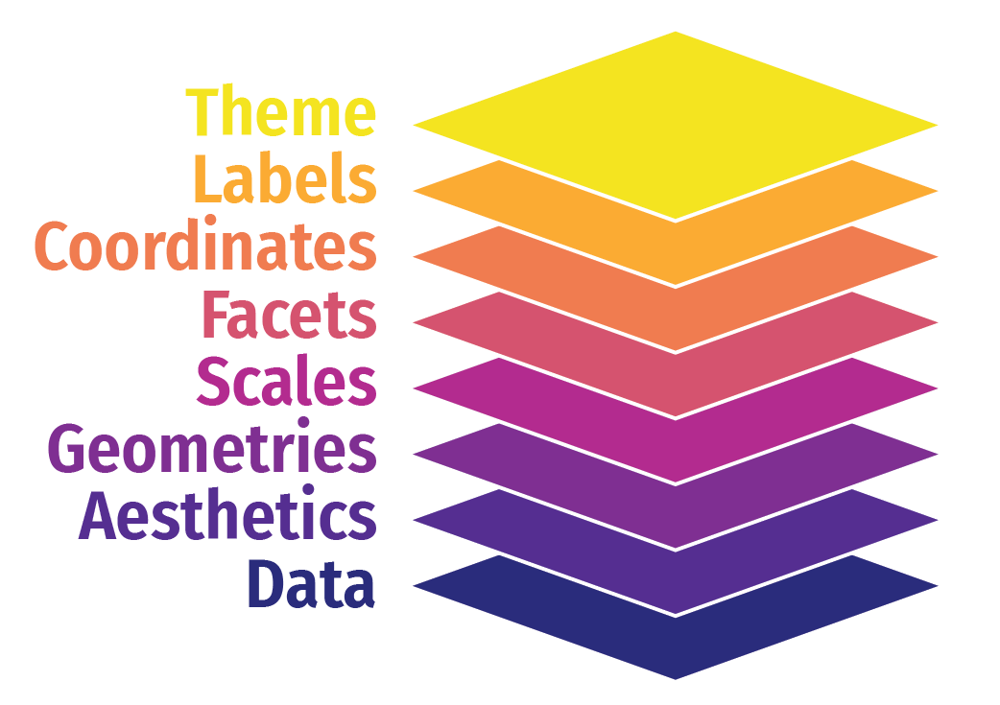

```{r setup, include=FALSE}
knitr::opts_chunk$set(warning = FALSE, message = FALSE, 
                      fig.retina = 3, fig.align = "center")
```

```{r packages-data, include=FALSE}
library(tidyverse)
library(ggthemes)
library(gapminder)
library(countdown)
library(flair)
library(knitr)
library(kableExtra)
```

```{r xaringanExtra, echo=FALSE}
xaringanExtra::use_xaringan_extra(c("tile_view"))
xaringanExtra::use_clipboard()
xaringanExtra::use_share_again()
```

class: center middle main-title section-title-1

# Visualisation<br>avec `ggplot2`


.class-info[
<figure>
  
</figure>
]

<br>


---

class: title title-1

# Voitures et cylindrée

.box-inv-1.medium[Quelle est la relation entre la cylindrée d'une voiture <br>et son autonomie?
]

---

class: title title-1 section-title-inv-1

# À votre tour #1

.box-1[Compilez le code du fichier Rmd pour créer un graphique]

.box-1[Portez attention à l'orthographe, aux majuscules et aux parenthèses!]

```{r eval=FALSE}
library(ggplot2)
ggplot(data = mpg) +
  geom_point(mapping = aes(x = displ, 
                           y = hwy))
```

```{r echo=FALSE}
countdown(minutes = 2, play_sound = TRUE, font_size = "1.5em")
```

---

```{r fig.width=6, fig.height=3.5, out.width="60%"}
ggplot(data = mpg) +
  geom_point(mapping = aes(x = displ, 
                           y = hwy))
```

---

layout: true
class: title title-1


# La grammaire des graphiques

.pull-left.center[

<figure>
  
</figure>

]

.pull-right[

.box-inv-1.medium[Composante esthétique]

.box-1[Propriété visuelle d'un graphique]

.box-1.sp-after[Position, forme, couleur, etc.]

.box-inv-1.medium[Variables]

.box-1[Une colonne d'une<br>base de données]

]


# Les voitures avec une plus grande cylindrée parcourent plus de distance?

```{r echo=FALSE, fig.width=6, fig.height=3.5, out.width="60%"}
ggplot(data = mpg) +
  geom_point(mapping = aes(x = displ, 
                           y = hwy))
```

---

# Esthétique

.pull-left-3[

.box-inv-1.small[`color` (discrète)]

```{r aes-color-discrete, echo=FALSE, fig.dim=c(4, 2), out.width="100%"}
eg <- tribble(
  ~x, ~y, ~size, ~x1,
  "A", 1, 5, 1,
  "B", 1, 10, 2,
  "C", 1, 15, 3
)

# Color, discrete
ggplot(eg, aes(x = x, y = y, color = x)) +
  geom_point(size = 30) +
  guides(color = 'none') +
  theme(axis.text.y = element_blank(),
        axis.ticks = element_blank())
```

.box-inv-1.small[`color` (continue)]

```{r aes-color-continuous, echo=FALSE, fig.dim=c(4, 2), out.width="100%"}
# Color, continuous
ggplot(eg, aes(x = x1, y = y, color = x1)) +
  geom_point(size = 30) +
  guides(color = 'none') +
  coord_cartesian(xlim = c(0.5, 3.5)) +
  theme(axis.text.y = element_blank(),
        axis.ticks = element_blank())
```
]

.pull-middle-3[

.box-inv-1.small[`size`]

```{r aes-size, echo=FALSE, fig.dim=c(4, 2), out.width="100%"}
# Size
ggplot(eg, aes(x = x, y = y, size = x)) +
  geom_point() +
  scale_size_discrete(range = c(2, 30)) +
  guides(size = 'none') +
  theme(axis.text.y = element_blank(),
        axis.ticks = element_blank())
```

.box-inv-1.small[`fill`]

```{r aes-fill, echo=FALSE, fig.dim=c(4, 2), out.width="100%"}
# Fill
ggplot(eg, aes(x = x, y = y, fill = x)) +
  geom_point(size = 30, pch = 21, stroke = 5) +
  guides(fill = 'none') +
  theme(axis.text.y = element_blank(),
        axis.ticks = element_blank())
```
]

.pull-right-3[

.box-inv-1.small[`shape`]

```{r aes-shape, echo=FALSE, fig.dim=c(4, 2), out.width="100%"}
# Shape
ggplot(eg, aes(x = x, y = y, shape = x)) +
  geom_point(size = 30) +
  guides(shape = 'none') +
  theme(axis.text.y = element_blank(),
        axis.ticks = element_blank())
```

.box-inv-1.small[`alpha`]

```{r aes-alpha, echo=FALSE, fig.dim=c(4, 2), out.width="100%"}
# Alpha
ggplot(eg, aes(x = x, y = y, alpha = x)) +
  geom_point(size = 30) +
  guides(alpha = 'none') +
  theme(axis.text.y = element_blank(),
        axis.ticks = element_blank())
```
]

---

# Associer colonnes et esthétiques

.small[
```{r eval=FALSE}
ggplot(mpg) + geom_point(aes(x = displ, y = hwy, color = class))
ggplot(mpg) + geom_point(aes(x = displ, y = hwy, size = class))
ggplot(mpg) + geom_point(aes(x = displ, y = hwy, shape = class))
ggplot(mpg) + geom_point(aes(x = displ, y = hwy, alpha = class))
```
]

---

layout: false

```{r fig.width=6, fig.height=3.5, out.width="60%"}
ggplot(data = mpg) +
  geom_point(mapping = aes(x = displ, y = hwy, color = class))
```

---

class: title title-1 section-title-inv-1

# À votre tour #2

.box-1[Modifiez la couleur, la taille, la transparence et la forme des points de votre graphique.]

.box-1[Expérimentez!]

.box-1[Y a-t-il des différences selon qu'on associe une composante esthétique à des variables discrètes ou continues?]

.box-1[Quid si on utilise plusieurs composantes esthétiques?]

---

class: title title-1

# Comment créer ce graphique?

```{r echo=FALSE, fig.width=6, fig.height=3.5, out.width="70%"}
ggplot(data = mpg) +
  geom_point(mapping = aes(x = displ, y = hwy), color = "blue")
```

---

.left-code[
```{r color-aes-example, tidy=FALSE, message=FALSE, fig.show="hide", fig.dim=c(4.8, 3.75), out.width="100%"}
ggplot(mpg) +
  geom_point(aes(x = displ, y = hwy, 
                 color = class))
```
]

.right-plot[
`)
]

---

.left-code[
```{r color-set-example, tidy=FALSE, message=FALSE, fig.show="hide", fig.dim=c(4.8, 3.75), out.width="100%"}
ggplot(mpg) +
  geom_point(aes(x = displ, y = hwy), 
             color = "blue")
```
]

.right-plot[
`)
]

---

.pull-left[
.small[
```{r tidy=FALSE, message=FALSE, fig.dim=c(4.8, 3.75), out.width="100%"}
ggplot(mpg) +
  geom_point(aes(x = displ, y = hwy, 
                 color = "blue"))
```
]
]

.pull-right[
.small[
```{r tidy=FALSE, message=FALSE, fig.dim=c(4.8, 3.75), out.width="100%"}
ggplot(mpg) +
  geom_point(aes(x = displ, y = hwy), 
             color = "blue")
```
]
]

---

layout: true
class: title title-1

---

# Similarités et différences?

.pull-left[
```{r echo=FALSE, tidy=FALSE, message=FALSE, fig.dim=c(4.8, 3.75), out.width="100%"}
ggplot(mpg) +
  geom_point(aes(x = displ, y = hwy))
```
]

.pull-right[
```{r echo=FALSE, tidy=FALSE, message=FALSE, fig.dim=c(4.8, 3.75), out.width="100%"}
ggplot(mpg) +
  geom_smooth(aes(x = displ, y = hwy))
```
]

---

# Géométries

```{r show-ggplot-template1, echo=FALSE, tidy=FALSE}
decorate('
ggplot(data = DONNÉES) +
  FONCTION_GEOM(mapping = aes(APPLICATION ESTHÉTIQUE))
', eval = FALSE) %>% 
  flair("DONNÉES", background = "#CBB5FF", before = "<b>", after = "</b>") %>% 
  flair("FONCTION_GEOM", background = "#FFDFD1", before = "<b>", after = "</b>") %>% 
  flair("APPLICATION ESTHÉTIQUE", background = "#FFD0CF", before = "<b>", after = "</b>") |>
  flair::knit_print.with_flair()
```

---

# Géométries

<table>
  <tr>
    <th class="cell-left"></th>
    <th class="cell-left">Exemple de géométrie</th>
    <th class="cell-left">Sortie</th>
  </tr>
  <tr>
    <td class="cell-left"></td>
    <td class="cell-left"><code class="remark-inline-code">geom_col()</code></td>
    <td class="cell-left">Diagramme à bande</td>
  </tr>
  <tr>
    <td class="cell-left"></td>
    <td class="cell-left"><code class="remark-inline-code">geom_text()</code></td>
    <td class="cell-left">Texte</td>
  </tr>
  <tr>
    <td class="cell-left"></td>
    <td class="cell-left"><code class="remark-inline-code">geom_point()</code></td>
    <td class="cell-left">Nuage de points</td>
  </tr>
  <tr>
    <td class="cell-left"></td>
    <td class="cell-left"><code class="remark-inline-code">geom_boxplot()</code>&emsp;</td>
    <td class="cell-left">Boîte à moustaches</td>
  </tr>
</table>

---

# Inventaire de géométries

.box-inv-1[Beaucoup de géométries disponibles!]

.box-1[Voir [la documentation `ggplot2`](https://ggplot2.tidyverse.org/reference/index.html#section-layer-geoms) pour<br>un exemple exhaustif avec toutes les géométries.]

.box-1[Ou la feuille aide-mémoire `ggplot2`]

---

layout: false
class: title title-1 section-title-inv-1

# À votre tour #3

.box-1[Remplacez le nuage de point par des boîtes à moustache. Utilisez l'aide mémoire.]

.pull-left[
```{r echo=FALSE, tidy=FALSE, message=FALSE, fig.dim=c(4.8, 3.25), out.width="100%"}
ggplot(mpg) +
  geom_point(aes(x = class, y = hwy))
```
]

.pull-right[
```{r echo=FALSE, tidy=FALSE, message=FALSE, fig.dim=c(4.8, 3.25), out.width="100%"}
ggplot(mpg) +
  geom_boxplot(aes(x = class, y = hwy))
```
]

```{r echo=FALSE}
countdown(minutes = 3)
```

---

class: title title-1 section-title-inv-1

# À votre tour #4

.box-1[Produisez un histogramme de `hwy`. Utilisez l'aide mémoire.<br>Indice: ne pas fournir de variable `y`.]

```{r echo=FALSE, tidy=FALSE, message=FALSE, fig.dim=c(7, 3.25), out.width="70%"}
ggplot(mpg) +
  geom_histogram(aes(x = hwy))
```

---

class: title title-1 section-title-inv-1

# À votre tour #5

.box-1[Colorez la densité de `hwy` par `class`.<br>Utilisez l'aide mémoire.<br> Indice: ne pas fournir de variable `y`.]

```{r echo=FALSE, tidy=FALSE, message=FALSE, fig.dim=c(7, 3.25), out.width="70%"}
ggplot(mpg) +
  geom_density(aes(x = hwy, color = class))
```

---

class: title title-1

# Graphiques complexes!

```{r echo=FALSE, fig.width=6, fig.height=3.5, out.width="70%"}
ggplot(data = mpg) +
  geom_point(mapping = aes(x = displ, y = hwy)) +
  geom_smooth(mapping = aes(x = displ, y = hwy))
```

---

class: title title-1 section-title-inv-1

# À votre tour #6

.box-1[Prédisez ce que le code produit, puis compilez.]

```{r eval=FALSE}
ggplot(data = mpg) +
  geom_point(mapping = aes(x = displ, y = hwy)) +
  geom_smooth(mapping = aes(x = displ, y = hwy))
```

```{r echo=FALSE}
countdown(minutes = 2)
```

---

class: title title-1

# Global vs. local

.box-inv-1[Toute composante esthétique dans `ggplot()`<br> est utilisée dans toutes les strates `geom_`]

.small[
```{r fig.width=6, fig.height=2.5, out.width="60%"}
ggplot(data = mpg, mapping = aes(x = displ, y = hwy)) +
  geom_point() +
  geom_smooth()
```
]

---

class: title title-1

# Global vs. local

.box-inv-1[Toute composante esthétique fournie dans la strate `geom_`<br> s'applique uniquement à cette dernière]

.small[
```{r fig.width=6, fig.height=2.5, out.width="60%"}
ggplot(data = mpg, mapping = aes(x = displ, y = hwy)) +
  geom_point(mapping = aes(color = drv)) +
  geom_smooth()
```
]

---

layout: true
class: title title-1

---

# Bien plus

.pull-left[
.box-inv-1[Plusieurs strates pour améliorer l'aspect visuel!]

.box-inv-1[On ajoute des strates séquentiellement pour créer des figures complexes]
]

.pull-right[

]

---

# Mettre tout ensemble

.box-inv-1.medium[On construit le graphique étape par étape<br>pour voir l'impact des strates<br>sur l'apparence.]

---

layout: false

.left-code[
.box-1[Données et composantes esthétiques globales]

```{r mpg-layers-1, tidy=FALSE, message=FALSE, fig.show="hide", fig.dim=c(4.8, 5), out.width="100%"}
ggplot(data = mpg,                  #<<
       mapping = aes(x = displ,     #<<
                     y = hwy,       #<<
                     color = drv))  #<<
```
]

.right-plot[
`)
]

---

.left-code[
.box-1[Ajouter une strate géométrique (nuage de points)]

```{r mpg-layers-2, tidy=FALSE, message=FALSE, fig.show="hide", fig.dim=c(4.8, 5), out.width="100%"}
ggplot(data = mpg,
       mapping = aes(x = displ,
                     y = hwy,
                     color = drv)) +
  geom_point() #<<
```
]

.right-plot[
`)
]

---

.left-code[
.box-1[Ajouter une composante de lissage]

```{r mpg-layers-3, tidy=FALSE, message=FALSE, fig.show="hide", fig.dim=c(4.8, 5), out.width="100%"}
ggplot(data = mpg,
       mapping = aes(x = displ,
                     y = hwy,
                     color = drv)) +
  geom_point() +
  geom_smooth() #<<
```
]

.right-plot[
`)
]

---

.left-code[
.box-1[Changer la droite de lissage par une régression linéaire]

```{r mpg-layers-4, tidy=FALSE, message=FALSE, fig.show="hide", fig.dim=c(4.8, 5), out.width="100%"}
ggplot(data = mpg,
       mapping = aes(x = displ,
                     y = hwy,
                     color = drv)) +
  geom_point() +
  geom_smooth(method = "lm") #<<
```
]

.right-plot[
`)
]

---

.left-code[
.box-1[Choisir la palette de couleur]

```{r mpg-layers-5, tidy=FALSE, message=FALSE, fig.show="hide", fig.dim=c(4.8, 5), out.width="100%"}
ggplot(data = mpg,
       mapping = aes(x = displ,
                     y = hwy,
                     color = drv)) +
  geom_point() +
  geom_smooth(method = "lm") +
  scale_color_viridis_d() #<<
```
]

.right-plot[
`)
]

---

.left-code[
.box-1[Séparer en panneaux]

```{r mpg-layers-6, tidy=FALSE, message=FALSE, fig.show="hide", fig.dim=c(4.8, 5), out.width="100%"}
ggplot(data = mpg,
       mapping = aes(x = displ,
                     y = hwy,
                     color = drv)) +
  geom_point() +
  geom_smooth(method = "lm") +
  scale_color_viridis_d() +
  facet_wrap(vars(drv), ncol = 1) #<<
```
]

.right-plot[
`)
]

---

.left-code[
.box-1[Ajouter des étiquettes]

```{r mpg-layers-7, tidy=FALSE, message=FALSE, fig.show="hide", fig.dim=c(4.8, 5), out.width="100%"}
ggplot(data = mpg,
       mapping = aes(x = displ,
                     y = hwy,
                     color = drv)) +
  geom_point() +
  geom_smooth(method = "lm") +
  scale_color_viridis_d() +
  facet_wrap(vars(drv), ncol = 1) +
    labs(x = "cylindrée (litres)", #<<
       y = "",#<<
       subtitle = "autonomie sur l'autoroute (mile au gallon)", #<<
       color = "type", #<<
       title = "Cylindrée imposante rime avec moins d'autonomie.", #<<
       caption = "Je connais rien aux voitures") #<<
```
]

.right-plot[
`)
]

---

.left-code[
.box-1[Ajouter un thème]

```{r mpg-layers-8, tidy=FALSE, message=FALSE, fig.show="hide", fig.dim=c(4.8, 5), out.width="100%"}
ggplot(data = mpg,
       mapping = aes(x = displ,
                     y = hwy,
                     color = drv)) +
  geom_point() +
  geom_smooth(method = "lm") +
  scale_color_viridis_d() +
  facet_wrap(vars(drv), ncol = 1) +
  labs(x = "cylindrée (litres)", 
       y = "",
       subtitle = "autonomie sur l'autoroute (mile au gallon)",
       color = "type", 
       title = "Cylindrée imposante rime avec moins d'autonomie.",
       caption = "Je connais rien aux voitures") +
  theme_bw() #<<
```
]

.right-plot[
`)
]

---

.left-code[
.box-1[Modifier le thème]

```{r mpg-layers-9, tidy=FALSE, message=FALSE, fig.show="hide", fig.dim=c(4.8, 5), out.width="100%"}
ggplot(data = mpg, 
       mapping = aes(x = displ,
                     y = hwy,
                     color = drv)) +
  geom_point() +
  geom_smooth(method = "lm") +
  scale_color_viridis_d() +
  facet_wrap(vars(drv), ncol = 1) +
  labs(x = "cylindrée (litres)", 
       y = "",
       subtitle = "autonomie sur l'autoroute (mile au gallon)",
       color = "type", 
       title = "Cylindrée imposante rime avec moins d'autonomie.",
       caption = "Je connais rien aux voitures") +
  theme_bw() +
  theme(legend.position = "bottom") #<<
```
]

.right-plot[
`)
]

---

.left-code[
.box-1[Terminé!]

```{r mpg-layers-finished, tidy=FALSE, message=FALSE, fig.show="hide", fig.dim=c(4.8, 5), out.width="100%"}
ggplot(data = mpg, 
       mapping = aes(x = displ,
                     y = hwy,
                     color = drv)) +
  geom_point() +
  geom_smooth(method = "lm") + 
  scale_color_viridis_d() +
  facet_wrap(vars(drv), ncol = 1) +
  labs(x = "cylindrée (litres)", 
       y = "",
       subtitle = "autonomie sur l'autoroute (mile au gallon)",
       color = "type", 
       title = "Cylindrée imposante rime avec moins d'autonomie.",
       caption = "Je connais rien aux voitures") +
  theme_bw() +
  theme(legend.position = "bottom")
```
]

.right-plot[
`)
]
