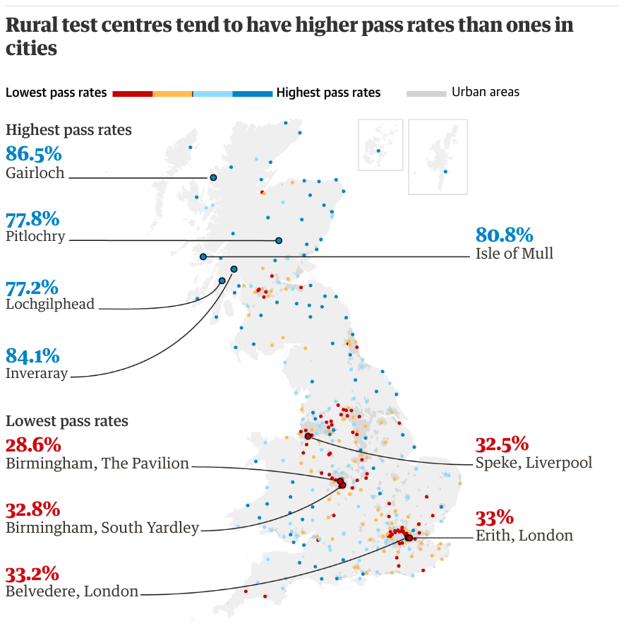

# Régression logistique

Expliquer le comportement de la **moyenne** d'une variable binaire $Y\in\{0,1\}$ en utilisant un modèle de régression avec $p$ variables explicatives $\mathrm{X}_1, \ldots, \mathrm{X}_p$.

$$\underset{\text{moyenne théorique}}{\mathsf{E}(Y=1 \mid \mathbf{X})} = \underset{\text{probabilité de succès}}{\Pr(Y=1 \mid \mathbf{X})}=p$$


Par convention, les zéros représentent des échecs et les uns des succès (même si $Y=1$ signifie mourir).


# Variables réponses binaires

Si la variable réponse $Y$ vaut soit $0$, soit $1$, on peut postuler une loi Bernoulli pour $Y$, soit
\begin{align*}
\Pr(Y=y) = p^y (1-p)^{1-y}, \quad y=0, 1.
\end{align*}

Il en découle que $\mathsf{E}(Y)=p$ et $\mathsf{Va}(Y)=p(1-p)$.

La variabilité est complètement déterminée par la moyenne.


# Exemples de questions de recherches


Questions comprenant une variable réponse binaire:

- est-ce qu'un client potentiel a répondu favorablement à une offre
promotionnelle?
- est-ce qu'un client est satisfait du service après-vente?
- est-ce qu'une firme va faire faillite au cours des trois prochaines années?
- est-ce qu'un participant à une étude réussit une tâche?


# Pourquoi pas une régression linéaire?

Les modèles linéaires ne sont pas adéquats pour les variables binaires.

- Sans contrainte, on peut obtenir des probabilités négatives ou supérieures à 1!
- Les données binaires ne respectent pas le postulat d'égalité des variances
    - Plus la probabilité de succès est près de 0.5, plus la variabilité est élevée.
    - Cette hétérogénéité invalide les résultats des tests d'hypothèse pour les coefficients.
 


# Modèle linéaire vs logistique


```{r}
#| eval: true
#| echo: false
#| cache: true
#| message: false
#| warning: false
#| out.width: '100%'
#| fig.width: 6
#| fig.height: 4
library(ggplot2)
data(HMDA, package = "AER")
ggplot(data = HMDA[which(HMDA$pirat < 1 & HMDA$afam == "yes"),],
       aes(y = ifelse(deny == "yes", 1, 0), 
           x = pirat)) +
  geom_hline(yintercept = c(0,1), 
             alpha = 0.1, 
             linetype = 2) + 
  geom_point() +
  stat_smooth(method = "lm", 
              se = FALSE, 
              fullrange = TRUE,
              col = 4) +
  stat_smooth(method = "glm", 
              se = FALSE,
              fullrange = TRUE,
              method.args = list(family = "binomial"), col = 2) +
  labs(subtitle = "", 
       y = "",
       x = "x") +
  scale_y_continuous(breaks=c(0L,1L), 
                     limits = c(0,1)) + 
  scale_x_continuous(breaks = seq(0,1, by = 0.25), 
                     limits = c(0,1),
                     expand = c(0,0),
                     labels = c("0","0.25","0.5","0.75","1")) + 
  geom_text(data = tibble::tibble(
    x = c(1,0.05), 
    y = c(0.1,0.9), 
    label = c("échec", "succès")), 
   aes(x = x, y = y, label = label),
   hjust = "inward") +
    theme_classic()
```
 
 
# Prédicteur linéaire

On considère une fonction pour la moyenne $\mathsf{E}(Y_i \mid \mathbf{X}_i)$ en fonction des variables explicatives.

Dans une régression linéaire, le prédicteur linéaire 

$$\eta = \beta_0 + \beta_1 \mathrm{X}_1 + \cdots + \beta_p \mathrm{X}_p$$
représente la moyenne de la variable réponse. 


Or, la probabilité doit être dans $[0,1]$, et $\eta \in \mathbb{R} = (-\infty, \infty)$.

 
# Fonction de liaison

On peut appliquer une transformation au **prédicteur linéaire**
$$\eta = \beta_0 + \beta_1 \mathrm{X}_1 + \cdots + \beta_p \mathrm{X}_p$$
pour que la prédiction soit entre zéro et un.

On considère la **fonction sigmoïde** (expit),
\begin{align*}
 p &= \textrm{expit}(\eta) = \frac{\exp(\eta)}{1+\exp(\eta)}
= \frac{1}{1+\exp(-\eta)}.
\end{align*}

# Courbe sigmoïde


```{r}
#| eval: true
#| echo: false
#| fig-align: 'center'
#| out-width: '100%'
#| fig-width: 6
#| fig-height: 3
library(ggplot2)
ggplot() +
  stat_function(fun = plogis, xlim = c(-5,5)) +
  labs(x = expression(eta), subtitle = "fonction sigmoïde", y = "probabilité de succès") +
  scale_x_continuous(labels = scales::label_number(drop0trailing = TRUE)) +
  scale_y_continuous(labels = scales::label_number(drop0trailing = TRUE),
                     limits = c(0,1),
                     expand = expansion()) +
  theme_classic()
```

```{r}
#| label: fig-logitplot
#| echo: false
#| out-width: '90%'
#| fig.height: 3
#| fig.width: 5
#| fig.cap: "Moyennes prédites en fonction du prédicteur linéaire $\\eta$."
#| eval: false
#| fig.align: 'center'
logit <- function(x){log(x/(1-x))}
expit <- function(x){1/(1+exp(-x))}
par(mar = c(4,4,1,0.1), bty = "l")
curve(expit, 
    ylim = c(0,1),
    yaxs="i",
    from = -5, 
    to = 5, 
    xlab = expression(eta), 
    ylab = expression(p))

```

<!--
# Modèles linéaires généralisés pour données binaires


Si notre variable réponse est binaire, on peut supposer que $Y_i$ suit une loi Bernoulli de paramètre $p_i$, $Y_i\sim \mathsf{Bin}(p_i)$, où
\begin{align*}
p_i= \Pr\left(Y_i=1 \mid \mathbf{X}_i\right)=\mathsf{E}(Y_i \mid \mathbf{X}_i).
\end{align*}

La fonction de liaison relie le prédicteur linéaire à la probabilité, typiquement à l'aide de la fonction logit 
\begin{align*}
g(z)\coloneqq\mathrm{logit}(z)=\ln\left(\frac{z}{1-z}\right).
\end{align*}
soit la **fonction quantile de la loi logistique** qui ici relie $\mathsf{E}(Y_i\mid \mathbf{X}_i)=p_i(\mathbf{X}_i)$ et $\eta_i$.


# Fonction de liaison logistique

Le modèle logistique spécifie
\begin{align*}
\eta_i=\ln\left(\frac{p_i}{1-p_i}\right)=\beta_0+ \beta_1 \mathrm{X}_{i1} + \cdots + \beta_p \mathrm{X}_{ip}.
\end{align*}

Ce modèle peut être exprimé sur l'échelle de la moyenne à l'aide de la fonction sigmoïde (inverse de logit), 
\begin{align*}
\mathsf{E}(Y_i \mid \mathbf{X}_i)=p_i=\frac{\exp(\beta_0+ \beta_1  \mathrm{X}_{i1} + \cdots + \beta_p \mathrm{X}_{ip})}{1+\exp(\beta_0+ \beta_1  \mathrm{X}_{i1} + \cdots + \beta_p \mathrm{X}_{ip})}.
\end{align*}

-->

<!-- 
# Interprétation du modèle


Cela donne une expression pour la moyenne $p_i=\mathsf{E}(Y_i\mid \mathbf{X}_i)$ en fonction des variables explicatives $\mathbf{X}_i$, mais...

 
-  à quoi ressemble cette fonction?
-  que nous apprend-elle sur la relation entre $p_i$ et $\eta_i$ (et donc $\mathbf{X}_{i}$)?

-->


# Fonction de répartition logistique


On voit que $p$ est une **fonction croissante** de $\eta=\beta_0 + \cdots + \beta_p \mathrm{X}_{p}$.
 
-  Si $\beta_j$ est positif et $\mathrm{X}_{j}$ augmente, $\Pr(Y=1)$ augmente aussi.  
-  Si $\beta_j$ est négatif et  $\mathrm{X}_{j}$ augmente, $\Pr(Y=1)$ diminue. 
-  La relation entre $\Pr(Y=1)$ et $\eta$ (et donc aussi $\mathrm{X}_{j}$) est *nonlinéaire*.


# Rappel exponentiels et logarithme

Quelques propriétés de la fonction exponentielle:

- $\exp(0) = 1$
- $\exp(a + b) = \exp(a)\exp(b)$
- $\exp(ab)= \exp(a)^b$

Quelques propriétés de la fonction logarithmique

- $\ln(1)=0$,
- $\ln(\exp(x))=x$ (fonction inverse)
- $\ln(ab) = \ln(a) + \ln(b)$

<!--

# Interprétation des paramètres de la régression logistique

L'effet des coefficients est en terme de **cote** et de **rapports de cote**.

-  Soit $p=\Pr\left(Y=1\mid \mathrm{X}_1, \ldots, \mathrm{X}_p\right)$ et le modèle de régression
\begin{align*}
\ln\left(\frac{p}{1-p}\right)=\beta_0+ \beta_1 \mathrm{X}_1 + \cdots + \beta_p\mathrm{X}_p.
\end{align*}
Si on prend l'exponentielle de chaque côté de l'équation précédente, 
\begin{align*}
\mathrm{cote}(Y\mid \mathbf{X}) = \frac{p}{1-p}=\exp(\beta_0+ \beta_1 \mathrm{X}_1 + \cdots + \beta_p\mathrm{X}_p),
\end{align*}
où $p/(1-p)$ est la cote $\Pr\left(Y=1 \mid \mathbf{X}\right)/\Pr\left(Y=0 \mid\mathbf{X}\right)$.

-->


# Cote

Si on applique la transformation inverse, on obtient

$$\ln\left(\frac{p}{1-p} \right) = \eta = \beta_0 + \beta_1 \mathrm{X}_1 + \cdots + \beta_p \mathrm{X}_p.$$

ou, en prenant l'exponentielle de chaque côté,

$$ 
\mathsf{cote} = \frac{p}{1-p} = \exp(\beta_0)\cdots\exp(\beta_p \mathrm{X}_p)
$$

**Modèle multiplicatif** pour la cote.

# Cote et probabilité

La cote est utilisée dans les paris sportifs
\begin{align*}
 \mathsf{cote}(p) = \frac{p}{1-p} = \frac{\Pr(Y=1 \mid \mathbf{X})}{\Pr(Y=0 \mid \mathbf{X})}.
\end{align*}


```{r}
#| label: tbl-cotes
#| eval: true
#| echo: false
#| tbl-cap: "Cote et probabilité de succès"
datf <- matrix("", nrow = 2, ncol = 10)
datf[1,] <- c("\\(p\\)", sprintf(seq(0.1,0.9, by = 0.1),fmt = "%.1f"))
datf[2,] <- c("cote", paste0("\\(",c("\\frac{1}{9}","\\frac{1}{4}","\\frac{3}{7}","\\frac{2}{3}","1","\\frac{3}{2}","\\frac{7}{3}","4","9"),"\\)"))
knitr::kable(datf[-1, , drop = FALSE], 
             col.names = datf[1, , drop = FALSE],
             row.names = FALSE,
             booktabs = TRUE,
             longtable = FALSE,
             align =  paste0(c("l",rep("c", 9)),collapse = ""),
             escape = FALSE,
             format = "latex") 
```


# Interprétation de l'ordonnée à l'origine en termes de cote

Si $\mathrm{X}_1=\cdots = \mathrm{X}_p=0$, il est clair que
\begin{align*}
\mathrm{cote}(Y\mid \mathbf{X}=\boldsymbol{0}_p) = \exp(\beta_0)
\end{align*}
et
\begin{align*}
\Pr\left(Y=1\mid  \mathbf{X}=\boldsymbol{0}_p\right) = \frac{\exp({\beta_0})}{1+\exp({\beta_0})}
\end{align*}
représente la probabilité que $Y=1$ quand $\mathbf{X}=\boldsymbol{0}_p$.

Comme pour la régression linéaire, $\mathrm{X}_1=\cdots =\mathrm{X}_p=0$ peut être impossible; dans ce cas, $\beta_0$ ne s'interprète pas.

# Interprétation en terme de rapport de cote

Dans le modèle logistique,le **rapport de cotes** quand $\mathrm{X}_k=x_k+1$ versus $\mathrm{X}_k=x_k$ quand $\mathrm{X}_j=x_j$ $(j=1, \ldots, p, j \neq k)$ est

\begin{align*}
\MoveEqLeft\frac{\mathrm{cote}(Y \mid  \mathrm{X}_k=x_k+1, \mathrm{X}_j=x_j, j\neq k)}{\mathrm{cote}(Y \mid \mathrm{X}_k=x_k, \mathrm{X}_j=x_j, j \neq k)}\\&=\frac{\exp\left(\beta_0+ \sum_{j=1}^p\beta_j x_j + \beta_k \right)}{\exp\left(\beta_0+ \sum_{j=1}^p\beta_j x_j \right)}\\
&= \exp(\beta_k).
\end{align*}

# Explication


Quand $\mathrm{X}_k$ augmente d'une unité *et que la valeur de toutes les autres covariables est constante*, la cote de $Y$ est multipliée par $\exp(\beta_k)$.

-  La cote augmente si $\exp(\beta_k) >1$, c'est-à-dire si $\beta_k>0$.
-  La cote diminue si $\exp(\beta_k) < 1$,  c'est-à-dire si $\beta_k<0$.


<!--
# Réduflation

On considère des données tirées de l'article

> [Evangelidis (2024)](https://doi.org/10.1287/mksc.2023.0269). Frontiers: Shrinkflation Aversion: When and Why Product Size Decreases Are Seen as More Unfair than Equivalent Price Increases. Marketing Science, 43(2), 280–288.

-->


<!--

# Données du PRCA

On dispose de 500 observations sur les variables suivantes dans la base de données `logit1`:
\footnotesize 

- $Y$: seriez-vous intéressé à acheter un produit recommandé par le PRCA
    - $\texttt{0}$: non
    - $\texttt{1}$: oui
- $\mathrm{X}_1$: quel genre d'emploi occupez-vous?
    - $\texttt{1}$: à la maison
    - $\texttt{2}$: employé
    - $\texttt{3}$: ventes/services
    - $\texttt{4}$: professionnel
    - $\texttt{5}$: agriculture/ferme
- $\mathrm{X}_2$: revenu familial annuel
    - $\texttt{1}$: moins de 25 000
    - $\texttt{2}$: 25 000 à 39 999
    - $\texttt{3}$: 40 000 à 59 999
    - $\texttt{4}$: 60 000 à 79 999
    - $\texttt{5}$: 80 000 et plus

\normalsize

# Données du PRCA    
    
\footnotesize

- $\mathrm{X}_3$: sexe
    - $\texttt{0}$: homme
    - $\texttt{1}$: femme
- $\mathrm{X}_4$: avez-vous déjà fréquenté une université?
    - $\texttt{0}$: non
    - $\texttt{1}$: oui
- $\mathrm{X}_5$: âge (en années)
- $\mathrm{X}_6$: combien de fois avez-vous assisté à un rodéo au cours de la dernière année?
    - $\texttt{1}$: 10 fois ou plus
    - $\texttt{2}$: entre six et neuf fois
    - $\texttt{3}$: cinq fois ou moins

\normalsize

-->
<!--
# Objectif de la régression

1) **Inférence** : comprendre comment et dans quelles mesures les variables $\mathbf{X}$ influencent la probabilité que $Y=1$.
2) **Prédiction** : développer un modèle pour prévoir des valeurs de $Y$ ou la probabilité de succès à partir des $\mathbf{X}$.

# Exemples

- Est-ce qu'un client potentiel va répondre favorablement à une offre promotionnelle?
- Est-ce qu'un client est satisfait du service après-vente?
- Est-ce qu'un client va faire faillite ou non au cours des trois prochaines années.

-->

# Ajustement du modèle

La fonction `glm` dans **R** ajuste un modèle linéaire généralisé (par défaut, linéaire avec `family = gaussian`).

- L'argument `family=binomial(link="logit")` permet de spécifier que l'on ajuste un modèle logistique.


```{r}
#| label: logistique-init
#| eval: false
#| echo: true
#| message: false
data(formatvente, package = "hecmulti")
# Données de l'expérience 3 de Duke et Amir (2023)
modele1 <- glm(formula = achat ~ format + marque,
            family = binomial(link = "logit"),
            data = formatvente)
summary(modele1)
```

On obtient un tableau résumé avec les coefficients (`summary`)


<!--
# Interprétation

Par défaut, pour des variables $0/1$, le modèle décrit la probabilité de succès.


```{r}
#| label: logitplot2
#| echo: false
#| eval: true
#| out.width: '70%'
#| fig.align: 'center'
#| fig.width: 7
#| fig.height: 3 
par(mar = c(4,4,1,0.1), bty = "l")
curve(expit(-3.05 + 0.0749 * x), 
    ylim = c(0,1),
    yaxs = "i",
    from = 18, 
    to = 59, 
    xlab = "âge (en années)", 
    ylab = "p")

```

Si le coefficient $\beta_j$ de la variable $\mathrm{X}_j$ est positif, alors plus la variable augmente, plus $\Pr(Y=1)$ augmente.

-->
<!--
# Interprétation avec données du PRCA

Le modèle ajusté en termes de cote est
\begin{align*}
 \frac{\Pr(Y=1 \mid \mathrm{X}_5=x_5)}{\Pr(Y=0 \mid \mathrm{X}_5=x_5)} = \exp(-3.05)\exp(0.0749x_5).
\end{align*}

\small

- Lorsque $\mathrm{X}_5$ augmente d'une année, la cote est multipliée par $\exp(0.0749) = 1.078$ peut importe la valeur de $x_5$. 
- Pour deux personnes dont la différence d'âge
    - est d'un an, la cote de la personne plus âgée est 7.8\% plus élevée
    - est de 10 ans, la cote de la personne plus âgée est 112\% plus élevée (cote multipliée par $\exp(10 \times 0.0749)=1.078^{10} = 2.12$)

\normalsize

# Modèle complet

On considère le modèle avec toutes les variables explicatives:

```{r}
#| eval: false
#| echo: true
modele2 <- glm(
  formula = y ~ .,
  data = logit1,
  family = binomial)
exp(coef(modele2))
```

```{r}
#| eval: true
#| echo: false
modele2 <- glm(
  formula = y ~ .,
  data = hecmulti::logit1,
  family = binomial)
round(exp(coef(modele2)), 3)
```

-->

# Interprétation des coefficients

Si on a plusieurs variables explicatives, les coefficients sont interprétés en modifiant une variable à la fois.

On compare deux profils identiques, sauf pour la variable en question 

- toute chose étant égale par ailleurs
- *ceteris paribus*

<!--

# Interprétation des coefficients

**Variable continue**:

- La cote de la personne plus âgée d'un an est 1.116 fois celle de la personne plus jeune, *ceteris paribus*, une augmentation de 11,6%

# Variable binaire

Le rapport de cote pour les femmes (`x3=1`) versus les hommes (`x3=0`) est de $\exp(\widehat{\beta}_{\mathrm{X}_3}) = 3.854$:

- les femmes sont plus susceptibles de suivre les recommendations d'achat toute chose étant égale par ailleurs, 
- Inversement, le rapport de cote homme/femme est de 1/3.854=0.259, 

On peut donc conclure que:

- la cote des femmes est 285.4% plus élevée que celle des hommes. 
- la cote des hommes est 74.1% inférieure à celle des femmes.

-->
<!--
# Variable catégorielle

Toutes les comparaisons sont effectuées avec la catégorie de référence.

Pour `x1`, c'est à la maison. Le rapport de cote est
$$\frac{\mathsf{cote}\{Y \mid \mathrm{X}_{1}=2 (\text{employé}), \ldots\}}{\mathsf{cote}\{Y \mid \mathrm{X}_{1}=1 (\text{maison}), \ldots\}} = \exp(\widehat{\beta}_{\mathrm{X}_{1}=2}) = 0.438$$

Le coefficient pour $\mathrm{X}_{1}=1$ est zéro, d'où $\exp(\widehat{\beta}_{\mathrm{X}_{1}=1})=1$ (absent du tableau).

On peut ordonner les type d'emploi selon la probabilité de succès à l'aide des coefficients: *ceteris paribus* on obtient le classement

- employé < professionnel < ventes/service < agriculture < maison.

# Invariance

Si on voulait le rapport de cote professionnel vs employé, inutile de réajuster le modèle.

On peut calculer 

$$ 
\dfrac{\dfrac{\mathsf{cote}(Y \mid \mathrm{X}_{1}=4, \ldots)}{\mathsf{cote}(Y \mid \mathrm{X}_{1}=1, \ldots)}}{\dfrac{\mathsf{cote}(Y \mid \mathrm{X}_{1}=2, \ldots)}{\mathsf{cote}(Y \mid \mathrm{X}_{1}=1, \ldots)}} = \frac{\exp(\widehat{\beta}_{\mathrm{X}_{1}=4})}{\exp(\widehat{\beta}_{\mathrm{X}_{1}=2})} =1.162746
$$

plutôt que de changer la catégorie de référence via

```{r}
#| eval: false
#| echo: true
logit2 <- logit1 |> 
   mutate(x1 = relevel(x1, ref = 2))
```

-->

# Vraisemblance et estimation du modèle

Pour un modèle probabiliste donné, on peut calculer la « probabilité » d'avoir obtenu les données de l'échantillon.

Si on traite cette « probabilité » comme une fonction des paramètres, on l'appelle **vraisemblance**.


**Maximum de vraisemblance**: valeurs des paramètres qui maximisent la fonction de vraisemblance.

- on cherche les valeurs des paramètres qui rendent les données les plus plausibles
   

# Vraisemblance d'une observation

La vraisemblance d'une observation $Y_i \in \{0,1\}$ (loi Bernoulli/binomiale) est 

\begin{align*}
L(\boldsymbol{\beta}; y_i) = p_i^{y_i}(1-p_i)^{1-y_i} = \begin{cases} 
p_i & y_i = 1 (\text{succès})\\
1-p_i & y_i = 0 (\text{échec}) 
\end{cases}
\end{align*}
et où $$p_i = \mathrm{expit}(\eta_i) = \frac{\mathrm{exp}(\beta_0 + \beta_1 \mathrm{X}_{i1} + \cdots + \beta_p\mathrm{X}_{ip})}{1+\mathrm{exp}(\beta_0 + \beta_1 \mathrm{X}_{i1} + \cdots + \beta_p\mathrm{X}_{ip})}.$$


# Probabilité conjointe d'événements binaires

- Si les observations sont indépendantes, la probabilité conjointe d'avoir un résultat donné est le produit des probabilités pour chaque observation. 
- Il n'y a pas de solution explicite pour $\widehat{\beta}_0, \ldots, \widehat{\beta}_p$ dans le cas de la régression logistique: il faut maximiser la vraisemblance.
   
# Log vraisemblance


- Pour des raisons de stabilité numérique, on maximise le logarithme naturel $\ell(\boldsymbol{\beta}) = \ln L(\boldsymbol{\beta})$ de la log vraisemblance conjointe de l'échantillon (transformation monotone croissante).
- La log vraisemblance est simplement la somme des contributions individuelles.
- On utilise la log vraisemblance $\ell$ comme mesure d'ajustement et pour construire des tests d'hypothèse.

# Prédiction des probabilités de succès

Des estimés des coefficients $\widehat{\beta}$ découlent une estimation de $\Pr(Y=1)$ pour les valeurs $\mathrm{X}_1=x_1, \ldots, \mathrm{X}_p=x_p$ d'un individu donné,
\begin{align*}
 \widehat{p} = \textrm{expit}(\widehat{\beta}_0 + \cdots + \widehat{\beta}_px_p).
\end{align*}


Un modèle avec uniquement l'ordonnée à l'origine retournera $\widehat{p}$, la proportion empirique de succès.
Comme pour la régression linéaire, c'est la moyenne des observations.


# Test du rapport de vraisemblance {.fragile}

:::: {.columns}

::: {.column width="60%"}

Pour les modèles ajustés par maximum de vraisemblance.


Comparaison de modèles **emboîtés**


- Modèle complet (sous l'alternative) avec $p$ variables explicatives
- Modèle restreint (sous l'hypothèse nulle) sur lequel on impose $k\leq p$ restrictions.


:::

::: {.column width="40%"}

```{r}
#| echo: false
#| eval: true
#| out.width: '100%'

```

:::

::::

# Exemple

Comparons un modèle avec et sans marque.

Variable catégorielle à deux niveaux (un coefficient associé).

```{r}
#| eval: true
#| echo: false
data(formatvente, package = "hecmulti")
# Données de l'expérience 3 de Duke et Amir (2023)
modele1 <- glm(formula = achat ~ format + marque,
            family = binomial(link = "logit"),
            data = formatvente)
```
```{r}
#| eval: true
#| echo: true
modele2 <- glm(formula = achat ~ format,
            family = binomial(link = "logit"),
            data = formatvente)
```

On teste l'hypothèse nulle  $\mathscr{H}_0: \beta_{2} = 0,$ où $\mathsf{X}_2 = \mathsf{I}_{\mathrm{marque}=\text{for your beauty}}$. L'hypothèse alternative est que le coefficient est non-nul.


# Rapport de vraisemblance

Le test est basé sur la statistique
\begin{align*}
 D = -2\{\ell(\widehat{\boldsymbol{\beta}}_0)-\ell(\widehat{\boldsymbol{\beta}})\}.
\end{align*}

Cette différence $D$, lorsque l'hypothèse $\mathscr{H}_0$ est vraie, suit approximativement une loi khi-deux $\chi^2_k$.

Si la valeur $p$ est inférieure au seuil de signification, typiquement $\alpha = 0.05$, on rejette l'hypothèse nulle.

# Exemple de test

\footnotesize

```{r}
#| eval: true
#| echo: true
# modèle 1 (alternative), modèle 2 (H0)
anova(modele2, modele1, test = "LR")
## Deviance = -2*log vraisemblance
rvrais <- modele2$deviance - modele1$deviance
pchisq(rvrais, df = 1, lower.tail = FALSE) # valeur-p
```

\normalsize

On conclut que la variable explicative $\mathrm{X}_2$ améliore significativement l'ajustement du modèle.

# Tester la significativité des variables

Si un paramètre n'est pas significativement différent de zéro, cela veut dire qu'il n'y a pas de lien significatif entre la variable et la réponse *une fois que les autres variables* sont dans le modèle.

\footnotesize

```{r}
#| eval: true
#| echo: true
car::Anova(modele1, type = 2)
```

\normalsize


# Intervalles de confiance pour coefficients

On peut aussi considérer des intervalles de confiance pour les coefficients individuels.

Ceux obtenus par défaut dans **R** sont appelés *intervalles de confiance de vraisemblance profilée*.

```{r}
#| eval: false
#| echo: true
confint(modele1)      # IC pour beta
exp(confint(modele1)) # IC pour exp(beta)
```

Ces intervalles sont invariants aux reparamétrisation: si $[b_i, b_s]$ est l'intervalle de vraisemblance profilée pour $\beta$, l'intervalle pour $\exp(\beta)$ est simplement $[\exp(b_i), \exp(b_s)]$.

# Intervalles de confiance

```{r}
#| label: fig-confint-modele2-logist
#| echo: false
#| eval: true
#| out-width: '80%'
#| fig-width: 10
#| fit-height: 4
#| fig-cap: "Intervalles de confiance profilés de niveau 95\\% pour les coefficients du modèle logistique (échelle exponentielle)."
modelsummary::modelplot(modele1, 
                        exponentiate = TRUE,
       coef_omit = 'Interc') + 
  ggplot2::labs(x = paste0("exp(", expression(beta),")")) +
  ggplot2::geom_vline(xintercept = 1)


```


# Tests et intervalles de confiances

Comme $\exp(\cdot)$ est  une transformation monotone croissante, 
$$\beta>0 \quad \iff \quad \exp(\beta)>1.$$

Si la valeur postulée, par exemple $\mathscr{H}_0: \beta_j=0$ ou $\exp(\beta_j)=1$, est dans l'intervalle de confiance de niveau $1-\alpha$, on ne rejette pas l'hypothèse nulle.

# Coefficients pour données complètes

\footnotesize

```{r}
#| label: tbl-logit1-complet
#| eval: true
#| echo: false
#| cache: true
#| tbl-cap-location: bottom
#| tbl-cap: "Modèle logistique avec toutes les variables catégorielles."
tbl <- modele1 |>
  gtsummary::tbl_regression(
  exponentiate = TRUE,
  intercept = FALSE) |>
  gtsummary::add_global_p() |>
  gtsummary::bold_labels()
tbl$table_styling$header$label[c(12,20,26,27)] <- c("variables","cote", "IC 95%","valeur-p")
tbl$table_body <- tbl$table_body[1:15,]
# tbl$table_body$label[1] <- "cst"
tbl$table_styling$footnote_abbrev$footnote <- 
  c("cote = rapport de cote",
    "IC = intervalle de confiance",
    "ET = erreur-type")
tbl |> 
   gtsummary::as_gt()  |>
   gt::tab_options(table.width = gt::pct(100))
```

\normalsize


# Multicolinéarité

Il est difficile de départager l'effet individuel d'une variable explicative lorsqu'elle est fortement corrélée avec d'autres.


La multicollinéarité ne dépend pas de la variable réponse $Y$, mais de la matrice $\mathbf{X}$ du modèle. Ce sont donc les mêmes diagnostics qu'en régression linéaire (MATH 60619): considérer les facteurs d'inflation de la variance (`car::vif`).

```{r}
#| eval: true
#| echo: true
car::vif(modele1)
```

Pas d'inquiétude ici, coefficients faibles (inférieurs à 5)

# Dichotomiser des variables continues

Si $Y$ est continue et qu'on cherche à estimer $\Pr(Y> c \mid \mathbf{X})$ pour une valeur $c$ donnée, il n'est **pas** recommandé de dichotomiser $Y$ via

\begin{align*}
Y^{*} = \begin{cases}
1, & Y > c; \\
0, & Y \leq c.
\end{cases}
\end{align*}

et d'ajuster une régression logistique.

Pourquoi? **On perd de l'information**.

# Probabilité de dépassement

On peut estimer plutôt une régression linéaire et prendre 
$$\Pr(Y > c \mid \mathbf{X}) = \Phi\left(\frac{\widehat{\mu}-c}{\widehat{\sigma}}\right),$$

où 

- $\widehat{\mu}=\widehat{\beta}_0 +  \cdots + \beta_p\mathrm{X}_p$ est la moyenne prédite pour le profil donné, 
- $\widehat{\sigma}$ est l'estimation de l'écart-type
- $\Phi(\cdot)$ est la fonction de répartition d'une loi normale standard (`pnorm` dans **R**)

# Modèle linéaire et probabilité d'excès

```{r}
#| eval: true
#| echo: false
#| label: fig-density-normalcurves
#| out-width: '80%'
#| fig-cap: "Régression linéaire simple et densité normale à différentes valeurs de $x$."
## Sample data
set.seed(0)
dat <- data.frame(x=(x=runif(100, 0, 50)),
                  y=rnorm(100, 10*x, 100))

## breaks: where you want to compute densities
breaks <- seq(0, max(dat$x), len=5)
dat$section <- cut(dat$x, breaks)

## Get the residuals
dat$res <- residuals(lm(y ~ x, data=dat))
ypos <- predict(lm(y~ x, data = dat), newdata = data.frame(x=breaks[-1]))
stdev <- sd(dat$res)
## Compute densities for each section, and flip the axes, and add means of sections
## Note: the densities need to be scaled in relation to the section size (2000 here)
xs <- seq(min(dat$y)-ypos[1]-100, max(dat$y)-ypos[4]+100, length.out = 200)
xs4 <- length(xs)*4L
dens <- data.frame(y = rep(xs, length.out = xs4) +
                       rep(ypos, each = length(xs)),
                   x = rep(breaks[-1], each = length(xs)) - 
                     rep(2000*dnorm(xs, 0, stdev), length.out = xs4),
                   section = factor(rep(levels(dat$section), each = length(xs))))

## Plot both empirical and theoretical
ggplot(dat, aes(x, y)) +
  geom_point() +
  geom_smooth(method="lm", fill=NA, lwd=2) +
  geom_path(data=dens, 
            aes(x, y, group=interaction(section)), lwd=1.1) +
  geom_vline(xintercept=breaks, lty=2) +
  labs(x = "", y = "") +
  theme_bw()
  
```

# Problèmes avec la régression logistique

Il arrive que, lors de l'ajustement d'une régression logistique, on obtienne un message d'avertissement: 

\footnotesize

```{r}
#| echo: true
#| eval: false
Warning messages:
1: glm.fit: algorithm did not converge 
2: glm.fit: fitted probabilities numerically 0 or 1 occurred 
```

\normalsize

# Quasi-séparation de variables

Le deuxième message d'erreur survient quand une combinaison linéaire de variables explicatives permet de prédire exactement la réponse: nos probabilités prédites sont $0$ ou $1$.

- par exemple, si on ajuste un modèle pour `yachat` en fonction de `ymontant`.

\footnotesize

```{r}
#| eval: false
#| echo: true
data(dbm, package = "hecmulti")
quasisep <- dbm |>  
  # remplacer les valeurs manquantes par des zéros et standardiser
  dplyr::mutate(ymontant = scale(ifelse(yachat == 0, 0, ymontant)))
# Régression logistique pour l'achat (0 ou 1) en fonction du montant
modele_qs <- glm(yachat ~ ymontant, 
              family = binomial, 
              data = quasisep)
```

\normalsize

# Illustration de la séparation de variables

```{r}
#| echo: false
#| eval: true
#| out-width: '60%'
#| fig-width: 8
#| fig-height: 5
#| fig-align: center
set.seed(1234)
x <- sort(rexp(20, rate = 0.2))
y <- as.integer(x>9)
m1 <- glm(y~ x, family=binomial)
fittedsepmod <- function(x){1/(1+exp(-coef(m1)[1] - x*coef(m1)[2]))}
library(ggplot2)
ggplot(data.frame(x, y), aes(x=x,y=y)) +
  geom_point() +
  geom_function(fun = fittedsepmod, n = 1001L, linewidth = 1.1) +
  scale_y_continuous(breaks = seq(0, 1, by = 0.25), labels = c("0","0.25","0.5","0.75","1")) +
  labs(y = "", x = "x") +
  theme_classic()
```

\footnotesize 

Quasi-séparation de variable: les estimations des paramètres sont presques infinies pour permettre une transition abrupte de la probabilité de succès de $\widehat{p}=0$ à $\widehat{p}=1$ à $x=9$.

\normalsize

# Coefficients avec séparation de variable

Les valeurs élevées des coefficients et erreurs-type sont une autre indication de quasi-séparation de variables.

Avec des variables standardisées, un coefficient $|\beta_j| > 10$ est suspect.

```{r quasisepvar}
#| echo: false
#| eval: true
#| label: tbl-quasisep
#| tbl-cap: "Modèle logistique pour `yachat` en fonction de `ymontant` (variable standardisée)."
#| warning: false
#| message: false
data(dbm, package = "hecmulti")
quasisep <- dbm |>  
  # remplacer les valeurs manquantes par des zéros et standardiser
  dplyr::mutate(ymontant = scale(ifelse(yachat == 0, 0, ymontant)))
# Régression logistique pour l'achat (0 ou 1) en fonction du montant
m1 <- glm(yachat ~ ymontant, 
              family = binomial, 
              data = quasisep)
tab1 <- data.frame(estimate = as.numeric(m1$coefficients), "std.error" = as.numeric(sqrt(diag(vcov(m1)))))
colnames(tab1) <- c("coef.", "erreur-type")
tab1 <- apply(tab1, 1:2, function(x){paste0("$", sprintf(x, fmt = "%.1f"), "$")})
rownames(tab1) <- c("cst","ymontant")
knitr::kable(x = tab1, align = "rrr", booktabs = TRUE, escape = FALSE)
```


# Causes de la quasi-séparation de variables

Typiquement, le problème survient parce que

- on a ajouté un dérivé de la variable réponse comme variable explicative
- on a un modèle surajusté, souvent une variable catégorielle pour laquelle toutes les observations d'un niveau donné ont la même réponse, soit $0$ ou $1$.

Ce n'est pas nécessairement un enjeu pour la prédiction, mais c'est souvent indicateur de problèmes plus importants. Les coefficients et interprétations ne sont plus valides...

# Solutions pour la quasi séparation de variables

1. Regarder quelles probabilités sont presque $0$ ou $1$ pour identifier les observations problématiques et s'assurer que l'échantillon que l'on emploie est adéquat.
   - Par exemple, les femmes ne peuvent pas avoir un cancer de la prostate, donc la probabilité prédite pour ces dernières est $0$. On pourrait simplement enlever les femmes et prédire zéro manuellement.
2. Déterminer si une variable explicative cause du surajustement en étudiant les coefficients dont la valeur absolue est très élevée.


# Régression logistique pour des proportions
 
- Souvent, seules les données aggrégées sont disponibles et on a accès au nombre de réussites (sur $m$ essais).
- On peut utiliser la loi binomiale pour le modèle logistique en ajoutant le nombre d'essais au modèle.
- L'interprétation des paramètres reste identique.


# Variables réponses binaires cumulées

Si les données représentent la somme d'événements Bernoulli indépendants, la loi du nombre de réussites $Y \in \{0, \ldots, m\}$ sur le nombre d'essais $m$ est binomiale avec fonction de masse
\begin{align*}
\Pr(Y=y) = \binom{m}{y}p^y (1-p)^{m-y}, \quad y=0, 1.
\end{align*}

La vraisemblance pour un échantillon $\mathsf{Bin}(m, p)$  est à constante près la même que pour un échantillon aléatoire de $m$ variables Bernoulli indépendantes.

L'espérance (moyenne théorique) est $\mathsf{E}(Y)=mp$ et la variance $\mathsf{Va}(Y)=mp(1-p)$. 


# Exemple: succès pour les examens de conduite

On considère le taux de succès dans 346 centres pour examens de conduite pratique en Grande-Bretagne; les [données](https://www.gov.uk/government/statistical-data-sets/driving-test-statistics-drt) datent de 2018.

```{r}
#| eval: true
#| echo: false
#| fig-align: "center"

```

# Résumé de l'article

761 750 personnes on réussi l'examen pratique, pour 1 663 897 essais.

- Un [article du journal *The Guardian*](https://www.theguardian.com/world/2019/aug/23/an-easy-ride-scottish-village-fuels-debate-driving-test-pass-rates) a suggéré que le taux de réussite était significativement plus élevé dans la campagne écossaise. 

Puisque nous n'avons pas de classification des centres de test ruraux/urbains, on utilise le nombre d'examens passés comme proxy.

Les autres variables explicatives sont le sexe de l'individu et la région en Angleterre; toutes les subdivisions d'Écosse et du Pays de Galles sont regroupées par royaume.

---

```{r}
#| eval: true
#| echo: false
#| fig-align: "center"
#| out-width: "80%"

```

---

# Récapitulatif

- Une régression logistique sert à modéliser la moyenne de **variables catégorielles**, typiquement binaires.
- C'est un cas particulier d'un modèle de régression linéaire généralisée (GLM)

# Récapitulatif

Le modèle est interprétable à l'échelle de la cote

- La cote donne le rapport probabilité de réussite (1) sur probabilité d'échec (0)
- Interprétation en terme de 
   - pourcentage d'augmentation si $\exp(\widehat{\beta}) > 1$, avec $\exp(\widehat{\beta})-1$.
   - pourcentage de diminution si $\exp(\widehat{\beta}) < 1$, avec $1-\exp(\widehat{\beta})$

# Récapitulatif

- Estimation par maximum de vraisemblance
- Tests d'hypothèse comparent modèles emboîtés 
   - loi nulle asymptotique $\chi^2$
   - degrés de liberté égal au nombre de restrictions
- Intervalles de confiance de vraisemblance profilée
   - invariants aux reparamétrisations

