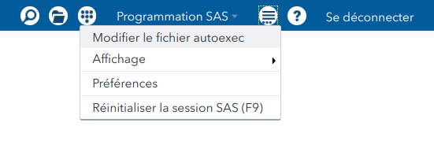
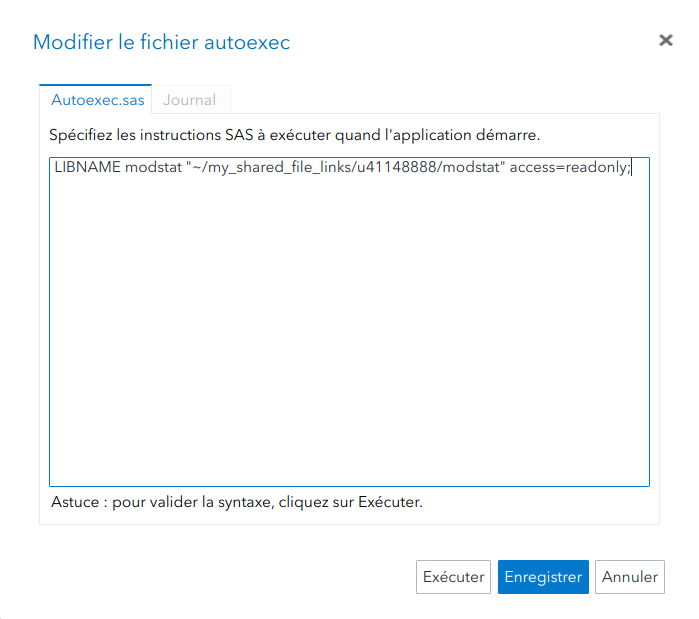
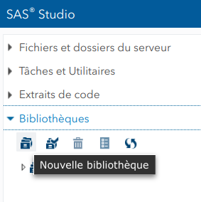
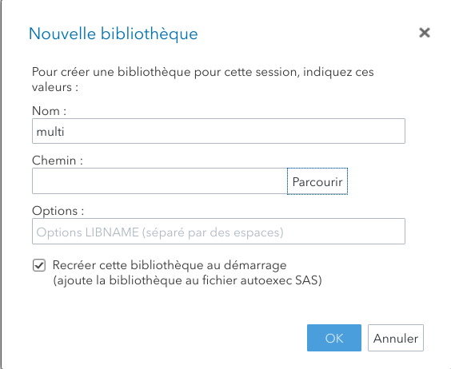

## SAS onDemand for Academics: Studio

Inscrivez-vous sur *SAS OnDemand for Academics* et créez un compte sur https://odamid.oda.sas.com en sélectionnant l'option *Register for an account*.

Après avoir créé un compte utilisateur, suivez ces étapes:

- Inscrivez vous sur le centre de contrôle (*Control Center*) à https://odamid.oda.sas.com.
- Choisir l'option *Enroll in a course* dans la section *Enrollments* en bas de la page: cliquez sur le lien.
- Inscrivez le code du cours: `50a343b3-1e64-47e1-99f6-b4fd666fd0be`.
- Soumettez le formulaire.
- Confirmez le choix du cours et terminez l'inscription pour Studio

Si vous accédez à **SAS** onDemand, vous pouvez créer la bibliothèque contenant toutes les données utilisées en classe en mode lecture seule automatiquement en ajoutant la ligne suivante au fichier `autoexec`: `LIBNAME modstat "~/my_shared_file_links/u41148888/modstat" access=readonly;`

```{r localisationautoexec, out.width = '80%' , fig.alt = "Localisation du fichier `autoexec`", echo = FALSE, eval = TRUE, fig.align = "center"}

```
```{r modificationautoexec, out.width = '80%' , fig.alt = "Modification du fichier `autoexec`", echo = FALSE, eval = TRUE, fig.align = "center"}

```


## Introduction à **SAS**

Répétez les instructions précédentes, cette fois en ajoutant la bibliothèque suivante:

```{sas loadintro, eval = FALSE}
LIBNAME multi "~/my_shared_file_links/u41148888/multi" access=readonly;
```
Vous pouvez également télécharger les données ([fichier `.zip`](https://raw.githubusercontent.com/lbelzile/modstat/master/introSAS/Intro_SAS_data.zip)) et créer votre propre bibliothèque. Pour ce faire, créez un dossier contenant les bases de données (extension `.sas7bdat`) et utilisez les commandes suivantes: 

```{r nouvellebiblio, out.width = '40%' , fig.alt = "Création d'une nouvelle bibliothèque", echo = FALSE, eval = TRUE, fig.align = "center"}

```
```{r nouvellebiblio2, out.width = '80%' , fig.alt = "Sélection du répertoire", echo = FALSE, eval = TRUE, fig.align = "center"}

```


Les liens qui suivent contiennent une capsule vidéo avec une narration des diapositives, le code SAS utilisé dans les exemples ainsi que quelques exercices (le code SAS rattaché aux exercices contient les solutions annotées, mais je vous enjoins à essayer par vous même avant de les consulter).

- [Capsule vidéo (mot de passe: sas)](https://hecmontreal.yuja.com/V/Video?v=87013&node=440149&a=311352596&autoplay=1)
- [Diapositives](https://raw.githubusercontent.com/lbelzile/modstat/master/introSAS/MATH60619_SAS_intro.pdf)
- [Code](https://raw.githubusercontent.com/lbelzile/modstat/master/introSAS/MATH60619_SAS_intro.sas)
- [Exercices](https://raw.githubusercontent.com/lbelzile/modstat/master/introSAS/MATH60619_SASexercices.pdf)
- [Exercices (code SAS)](https://raw.githubusercontent.com/lbelzile/modstat/master/introSAS/MATH60619_SASexercices.sas)
- [Jeux de données (zip)](https://raw.githubusercontent.com/lbelzile/modstat/master/introSAS/Intro_SAS_data.zip)


## Installation du logiciel


Nous utiliserons uniquement les modules SAS/BASE et SAS/STAT. Si vous désirez installer **SAS** sur votre ordinateur (uniquement pour Windows) plutôt que d'utiliser la version serveur, vous pouvez télécharger et installer le logiciel: la licence institutionnelle offerte par les TIs est gratuite, mais ces derniers vous font payer le téléchargement. Vous pouvez partager cette dernière avec vos camarades. Si vous avez déjà acheté le logiciel par le passé, vous avez droit aux mises à jour gratuites. Le logiciel est disponible tant que vous êtes étudiant(e)s à HEC.


